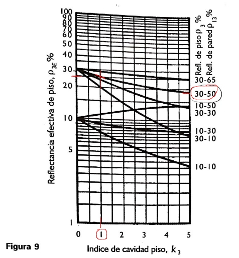
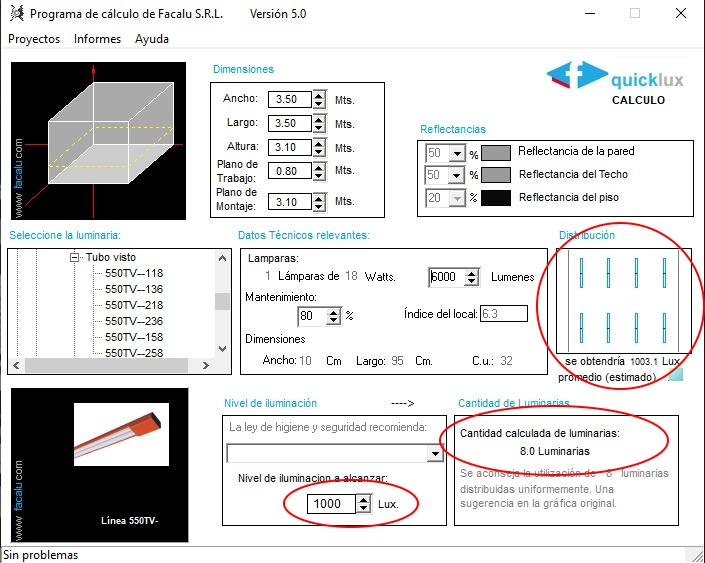

# Instalaciones 2021: Competencia de Luminotecnia.

#### Alumno:
* FERRARIS DOMINGO
* MAT: 36656566
* Ing. Electronica

----------------------
# Local 1

## Caracteristicas:

***Para este uso la norma IRAM - AADL J 20 06 recomienda un nivel minimo de 200 lux.***

## Metodo de las cavidades zonales.
-------------------------
***Se utilizo como luminarias para el metodo pares de tubos fluorescentes (2x36W, fi=6000 p/par), y un fm=.8.***

**1. Calculo indices de las cavidades.**

> Indices k1, k2, k3: (4.15, 0.59, 1.19).

**2. Reflectancia efectiva de cielo razo.**

Tomando un *indice 0.6 para la cavidad cielo razo*, entrando a la curva pared/cielo razo para 50/80%:  

> Se tomo una reflectancia efectiva del cielo razo del 70%.

**3. Coef de utilizacion.**

Ingresando a la tabla A para reflectancia efectiva de cielo razo 70%, pared 50% y tomando k1=4:

> Se tomo un cu base de 0.48. 

***Como la reflectancia del piso es distinta de 20%, se debe corregir cu.***

Entrando por curva 30/50% (piso/pared) y tomando k3=1:

> Se estimo una reflectancia efectiva del piso del 30%.

Luego para 30/50/4 tenemos de la tabla I un factor de correccion de 1.04.

Se corrije el cu base por multiplicacion, por ser la reflectancia del piso del 30%.

Cu basico: 0.48 con Factor de correccion: 1.04

> Correccion para 30%: cu=0.4992

**4. Cantidad de luminarias.**

Aplicando la ecuacion dada obtenemos el numero teorico de luminarias:

> Cantidad teorica de luminarias: 3.8.

* Se opto por usar 4 luminarias.
* Dividiendo la longitud a en **2 lineas de luminarias dispuestas a 1.6m de la pared y separadas 3.2m c/u.**
* Dividiendo la longitud l en **2 lineas de luminarias dispuestas a 1.8cm de la pared y separadas 3.5m c/u.**

> ***4 luminarias (pares de tubos fluorecentes):***
>> * * a: 2 lineas -> (1.6, << 3.2 >> ,1.6) mts = [6.5] mts
>> * * l: 2 lineas -> (1.8, << 3.5 >> ,1.8) mts = [7.0] mts

**5. Verificacion del nivel obtenido.**

Con 4 luminarias dispuestas de esta forma verificamos el nivel:

> Nivel obtenido: 210.7

## Verificacion por software QuickLux
---------------

## Equivalente LED.
---------------
***Se utilizaron tubos LED (2x36W, fi=2800 p/par), con factor indicado cu*fm=.6***

**1. Cantidad de luminarias**

Utilizando el equivalente para luminarias led donde cu*fm=0.6, se obtiene:

> *Cantidad teorica de luminarias: 2.46*

* Se opto por usar 4 luminarias (pares de tubos LEDs).
* Dividiendo la longitud a en **2 lineas de luminarias dispuestas a 1.6m de la pared y separadas 3.2m c/u.**
* Dividiendo la longitud l en **2 lineas de luminarias dispuestas a 1.8cm de la pared y separadas 3.5m c/u.**

> ***4 luminarias (pares de tubos led):***
>> * * a: 2 lineas -> (1.6, << 3.2 >> ,1.6) mts = [6.5] mts
>> * * l: 2 lineas -> (1.8, << 3.5 >> ,1.8) mts = [7.0] mts

**2. Verificacion del nivel obtenido.**
Con 4 luminarias dispuestas de esta forma:

> Nivel obtenido: 295.4

----------------------------
# Local 2

## Caracteristicas:

***Para este uso la norma IRAM - AADL J 20 06 recomienda un nivel minimo de 800 lux.***

## Metodo de las cavidades zonales.
***Se utilizo como luminarias para el metodo pares de tubos fluorescentes (2x36W, fi=6000 p/par), y un fm=.8***

**1. Calculo indices de las cavidades.**

> Indices k1, k2, k3: (5.06, 0.92, 2.07).

**2. Reflectancia efectiva de cielo razo.**

Tomando un indice 1 para la cavidad cielo razo, entrando a la curva pared/cielo razo para 70/80%:  

> Se tomo una reflectancia efectiva del cielo razo del 70%.

**3. Coef de utilizacion.**

Ingresando a la tabla A para reflectancia efectiva de cielo razo 70%, pared 70% y tomando k1=5:

> Se tomo un cu base de 0.50. 

Como la reflectancia del piso es 20%, no se corrige cu.

Cu basico: 0.50, Factor de correccion: 1.
> Correccion para 20%: 0.50

**4. Cantidad de luminarias.**

Aplicando la ecuacion dada obtenemos el numero teorico de luminarias:

> *Cantidad teorica de luminarias: 6.3.*

* Se opto por usar 8 luminarias.
* Dividiendo la longitud a en **2 lineas de luminarias dispuestas a 1.1m de la pared y separadas 2.1m c/u.**
* Dividiendo la longitud l en **4 lineas de luminarias dispuestas a 60cm de la pared y separadas 1.1m c/u.**        

> ***8 luminarias:***
>> * * a: 2 lineas -> (1.1, << 2.1 >> ,1.1) mts = [4.2] mts
>> * * l: 4 lineas -> (0.6, << 1.1 >> ,0.6) mts = [4.5] mts

**5. Verificacion del nivel obtenido.**

Con 8 luminarias dispuestas de esta forma verificamos el nivel:

> Nivel obtenido: 1015.9

## Verificacion por software QuickLux
---------------

## Equivalente LED.
---------------
***Se utilizaron tubos LED (2x36W, fi=2800 p/par), con factor indicado cu*fm=.6***

**1. Cantidad de luminarias**

Utilizando el equivalente para luminarias led donde cu*fm=0.6, se obtiene:

> *Cantidad teorica de luminarias: 4.5.*

* Se opto por usar 6 luminarias.
* Dividiendo la longitud a en 2 lineas de luminarias dispuestas a 1.1m de la pared y separadas 2.1m c/u.
* Dividiendo la longitud l en 3 lineas de luminarias dispuestas a 80cm de la pared y separadas 1.5m c/u.

> ***6 luminarias:***
>> * * a: 2 lineas -> (1.1, << 2.1 >> ,1.1) mts = [4.2] mts
>> * * l: 3 lineas -> (0.8, << 1.5 >> ,0.8) mts = [4.5] mts

**2. Verificacion del nivel obtenido.**
Con 4 luminarias dispuestas de esta forma:

> Nivel obtenido: 1066.7

-----------------------------------
# Local 3

## Caracteristicas:

***Para este uso la norma IRAM - AADL J 20 06 recomienda un nivel minimo de 1000 lux.***

## Metodo de las cavidades zonales.
---------------
***Se utilizo como luminarias para el metodo pares de tubos fluorescentes (2x36W, fi=6000 p/par), y un fm=.8.***

**1. Calculo indices de las cavidades.**

> Indices k1, k2, k3: (6.57, 0.0, 2.29).

**2. Reflectancia efectiva de cielo razo.**

En este caso las luminarias estan embutidas en el cielo razo:

> Se tomo una reflectancia efectiva del cielo razo del 50%.

**3. Coef de utilizacion.**

Ingresando a la tabla A para reflectancia efectiva de cielo razo 50%, pared 50% y tomando k1=6.6, interpolamos entre 6 y 7:

* Para 6 -> 0.37.
* Para 7 -> 0.34.

> Interpolando: Cu basico: 0.35.

Como la reflectancia del piso es 20%, no se corrige cu.

**4. Cantidad de luminarias.**

Aplicando la ecuacion dada obtenemos el numero teorico de luminarias:

> *Cantidad teorica de luminarias: 7.25.* 

* Se opto por usar 8 luminarias.
* Dividiendo la longitud a en **2 lineas de luminarias dispuestas a 90cm de la pared y separadas 1.8m c/u.**
* Dividiendo la longitud l en **4 lineas de luminarias dispuestas a 40cm de la pared y separadas 90cm c/u.**        

> ***8 luminarias:***
>> * * a: 2 lineas -> (0.9, << 1.8 >> ,0.9) mts = [3.5] mts
>> * * l: 4 lineas -> (0.4, << 0.9 >> ,0.4) mts = [3.5] mts

**5. Verificacion del nivel obtenido.**

Con 8 luminarias dispuestas de esta forma verificamos el nivel:

> Nivel obtenido: 1103.4

## Verificacion por software QuickLux
---------------

## Equivalente LED.
---------------
***Se utilizaron tubos LED (2x36W, fi=2800 p/par), con factor indicado cu*fm=.6***

**1. Cantidad de luminarias**

Utilizando el equivalente para luminarias led donde cu*fm=0.6, se obtiene:

> *Cantidad teorica de luminarias: 3.64.*

* Se opto por usar 4 luminarias.
* Dividiendo la longitud a en **2 lineas de luminarias dispuestas a 90cm de la pared y separadas 1.8m c/u.**
* Dividiendo la longitud l en **2 lineas de luminarias dispuestas a 90cm de la pared y separadas 1.8m c/u.**

> ***4 luminarias:***
>> * * a: 2 lineas -> (0.9, << 1.8 >> ,0.9) mts = [3.5] mts
>> * * l: 2 lineas -> (0.9, << 1.8 >> ,0.9) mts = [3.5] mts

**2. Verificacion del nivel obtenido.**

Con 4 luminarias dispuestas de esta forma:

> Nivel obtenido: 1097.1.

-----------------
## Salida del script para un caso de interpolacion.
 
Indices k1, k2, k3: (6.571428571428571, 0.0, 2.285714285714286)

Reflectividad eficaz tomada Cielo razo/Piso: 50/20 (GRAFICAS)

Cu basico: 0.35200000000000004, Factor de correccion: 1, 

Correccion para 20%: 0.35200000000000004

Cantidad teorica de luminarias: 7.250236742424242 -> Usadas: 8

8 luminarias:
        a: 2 lineas -> (0.9, << 1.8 >> ,0.9) mts = [3.5] mts
        l: 4 lineas -> (0.4, << 0.9 >> ,0.4) mts = [3.5] mts

Nivel obtenido: 1103.4

(envPy38) ferraris@lubuntu:/media/ferraris/Desk/UNC/instalaciones$ 