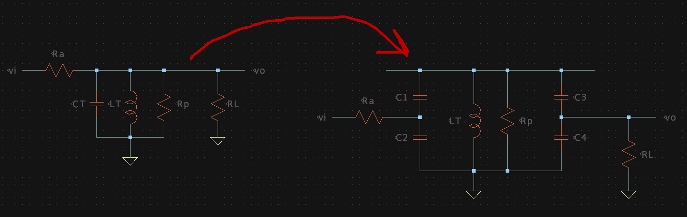
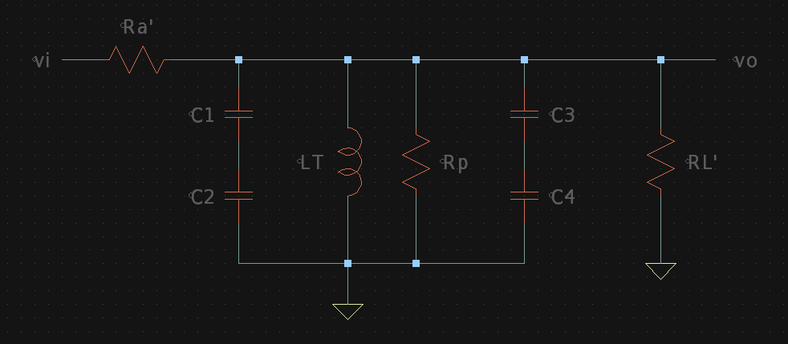
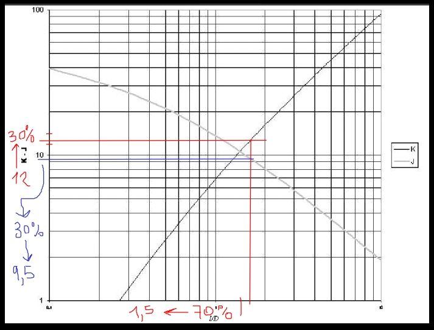
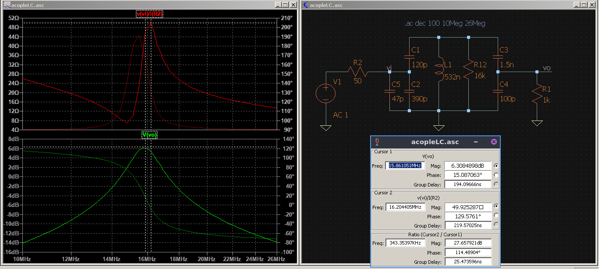
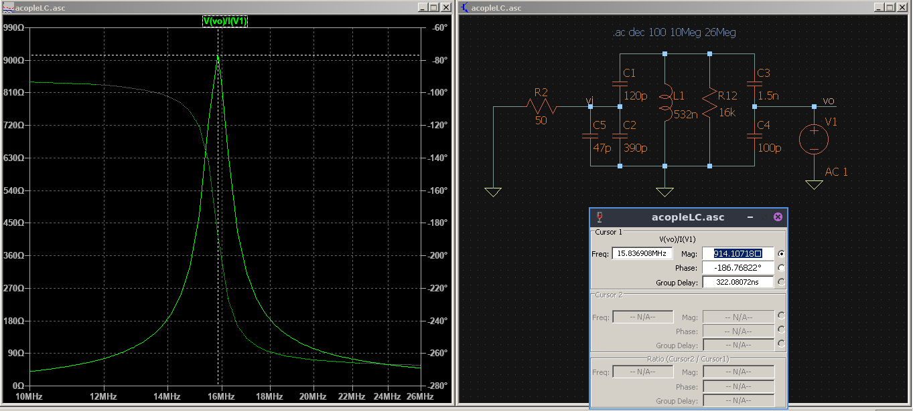
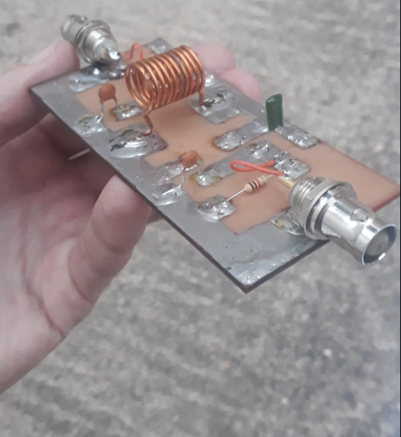
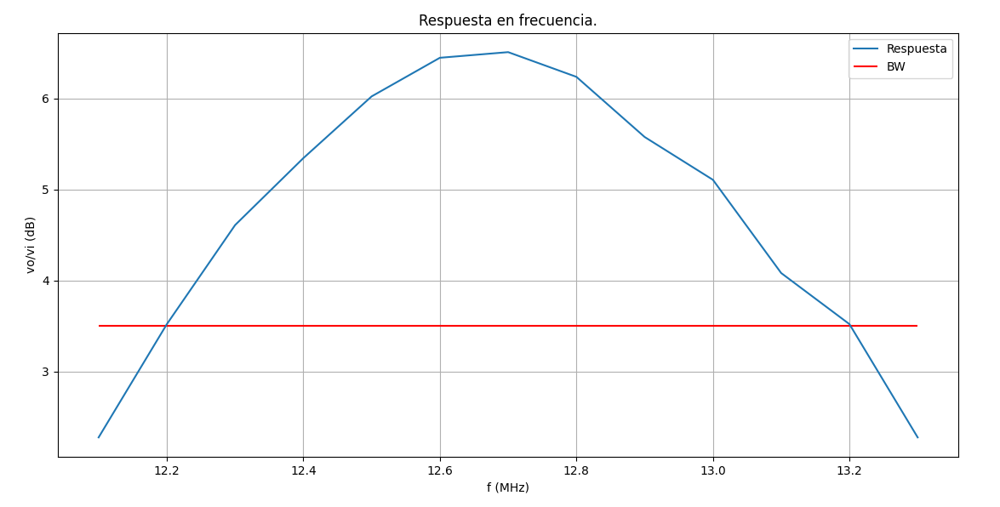

# FCEFyN - UNC - ELECTRÓNICA ANALOGICA III
## ALUMNO: Ferraris Domingo Jesus

---------------------------------------
---------------------------------------

# Laboratorio 1: 
## Acople sintonizado.

-----------------------------------------

## Caracteristicas del acople

Se diseño, implemento y midio un acople sintonizado con los siguientes requisitos:

* Frecuencia de resonancia: fo = 16MHz.
* Ancho de banda: BW = 10% de fo.
* Impedancia de entrada: Zi = 50 Ohm.
* Impedancia de salida: Zo = 1KOhm.

-----------------------------------------------------------
## Resumen teorico

Partimos de saber que en un ***circuito RLC en paralelo*** se cumplen:

$$
\begin{align*}
fo &= \frac{1}{2 \pi \sqrt{LT \cdot CT}}\newline
Qp &= \frac{RT}{2 \pi fo \cdot LT} = \frac{fo}{BW}
\end{align*} 
$$

> Realizando la siguiente transformacion:

Donde suponemos Ra resistencia de antena (generador de entrada) y Rp la resistencia paralela equivalente de perdidas del inductor.

Para simplificar el analisis, basandonos en un concepto similar al del autotransformador ***aplicamos una reflexion sobre Ra y RL***:

> Con las impedancias reflejadas:

$$
\begin{align*}
Ra' &= Ra \left(1 + \frac{C_{2}}{C_{1}}\right)^{2}\newline
RL' &= RL \left(1 + \frac{C_{4}}{C_{3}}\right)^{2}
\end{align*}
$$

> Y podemos sacar las relaciones:

$$
\begin{align*}
RT &= Ra' // (RL' // Rp)\newline
CT &= (C1(s)C2) // (C3(s)C4)
\end{align*} 
$$

Con lo cual se ve que ***variando los capacitores cambiamos el valor de impedancia vista en la entrada o salida***, logrando asi la adaptacion.

Ademas como esto cambia la RT del circuito podemos ***variar el BW*** del mismo.

**Definimos las siguientes igualdades para simplificar la etapa de diseño del acople:** 

$$
\begin{align*}
Ra' &= RL'//Rp = 2RT\newline
C1(s)C2 &= C3(s)C4 = \frac{CT}{2}
\end{align*}
$$

Con estas igualdades ***calculamos los capacitores*** y ***diseñamos la inductancia*** para cumplir con las especificaciones dadas.

-----------------------------------------------------------
## Diseño y simulacion

Usando las conclusiones teoricas se despejaron las ecuaciones para el diseño:

> Para los capacitores C1 y C2:

$$
\begin{align*}
C_{2} &= \frac{CT}{2} \sqrt{\frac{2RT}{Ra}}\newline
C_{1} &= \frac{C_{2}}{\sqrt{\frac{2RT}{Ra}} - 1}\newline
\end{align*}
$$

> Y para C3 y C4:

$$
\begin{align*}
C_{4} &= \frac{CT}{2} \sqrt{\frac{RL'}{RL}}\newline
C_{3} &= \frac{C_{4}}{\sqrt{\frac{RL'}{RL}} - 1}\newline
RL' &= \frac{2 RT}{1 - \frac{2 RT}{Rp}}
\end{align*}
$$

Se realizo un script en ***Python*** para hacer los calculos y graficas, y se utilizo el ***metodo de Nagaoka para diseño de inductores mono capa con nucleo de aire.***

### La metodologia seguida fue:

1. Definir ***diametro de alambre y del nucleo*** para el inductor.

2. Calcular inductancia para un K de 6.5 (***intentando obtener un inductor cuadrado inicialmente).***

3. Calcular la capacidad para resonar a la fo, ***definir esta capacidad para comenzar.***
* * Diseñar el inductor usando la curva K y sacar ***numero de espiras N.***
> ***Ecuacion de diseño:***
>> L[uH] = (Dind[cm])^3 * (Nsop[vue/cm])^2 * K * 1E-3

* * Comprobar valor con la curva J y ***usar este valor de inductancia.***
> ***Ecuacion de verificacion:***
>> L[uH] = N^2 * (Dind [cm])/2 * J * 1E-3

* * Calcular ***Q descargado*** con la ecuacion del metodo y obtener la resistencia equivalente de perdidas.
> ***Q descargado:***
>> Qd = (8850 * sqrt(fo[MHz]) * (Dind[cm] * l[cm])/(102*l[cm] + 45*Dind[cm])

4. Con la nueva inductancia, ***correjir la capacidad total*** para resonar. 

5. ***Calcular la RT*** para cumplir con el BW.

6. Buscar ***capacitores C1-4.***

* * Si C3 da negativo aumentar RT, para ello, se aumenta LT, se recalcula CT para resonar y ***se vuelve al paso 3.***

7. Al obtener valores de capacidades validos, ***simular y comprobar.***
* * ***Normalizar capacitores a valores comerciales***, sacar capacidad total, cambiar valor de inductancia y volver al paso 3.

8. Simular con valores comerciales ajustados.

Se comenzo con una CT de 310pF, para luego iterar 5 veces hasta los 169pF, donde las curvas de Nagaoka:

Nos dan un inductor de ***10 vueltas*** y 0.532uH aprox y una resistencia equivalente de perdidas de 16KOhm.

Luego se obtuvieron y normalizaron las capacidades, y utilizando ***LTSpice*** se simulo el circuito para la ***tension de salida e impedancia de entrada:***

Y para la ***impedancia de salida:***

Luego de superar satisfactoriamente el paso 8, se implemento el circuito con los siguientes componentes:

**Inductor:**
* 0.532 uH aprox.
* 10 espiras y diametro de cobre 1.2mm.
* Nucleo de 1cm, largo de 1.7cm aprox. 

**Capacitores:**
* Se diseño con C1=120pF, C2=(390//47)pF, C3=1.5nF y C4=100pF.

**Parametros:**
* Capacidad total con valores normalizados 188pF aprox.
* Resistencia equivalente de perdidas del inductor de 16KOhm.

**Agregados:**
* Se agrego un Cx=180pF, para mediciones de la fo.
* Se agrego una Rx=15KOhm, para medir el Q descargado.

-----------------------------------------------------------
## Armado en PCB

Se utilizo una ***PCB de 5x10cm***, haciendo el diseño con marcador indeleble, ademas se estañaron las pistas y agregaron los conectores BNC para entrada y salida.

En el diseño se agregaron pistas ***que posibiliten conectar/desconectar Cx, Rx y RL.***

-----------------------------------------------------------
## Mediciones en placa

Se utilizo el siguiente set-up de instrumentos:

**Generador:**
* BW = 20MHz.
* Impedancia de salida 50 Ohm.
* Tension de salida: 2 Vpp.

**Osciloscopio:**
* Digital con BW = 50MHz.

### Frecuencia de resonancia
Esta se midio de forma indirecta midiendo el nodo L-C1-C3  para ***simplificar la ecuacion de la capacidad total.***
Fue medicion indirecta debido a la capacidad parasita del osciloscopio que nos ***cambia la frecuencia de resonancia.***

En la misma se obtuvo la ***frecuencia fo1***, y luego ***fo2 agregando Cx*** en paralelo con la inductancia.

> Luego, aproximadamente:

$$
\begin{align*}
fo1 &= \frac{1}{2 \pi \sqrt{LT \cdot (CT+Cosc)}}\newline
fo2 &= \frac{1}{2 \pi \sqrt{LT \cdot (CT+Cosc+Cx)}}
\end{align*} 
$$

> Dividiendo miembro a miembro y llamando k a la relacion fo1/fo2

$$
\begin{align*}
CT + Cosc = \frac{Cx}{k^2 - 1}
\end{align*} 
$$

> Llamando a la anterior A y reemplazando en la ecuacion de fo1, se obtiene LT como:

$$
\begin{align*}
LT = \frac{1}{(2 \pi fo1)^2 \cdot A}
\end{align*} 
$$

**Mediciones:**
* fo1 = 12.34MHz.
* fo2 = 9.87MHz.
* **Con lo que LT = 0.520uH.**

> Utilizando el valor de capacidad total calculado y reemplazando en la ecuacion para resonancia:

**Finalmente: fo = 16.1MHz.**

### Q descargado

***Quitando la resistencia de carga*** y poniendo el circuito en resonancia ***se agrego Rx en serie con el generador***. Se midio la ***tension vi en el punto de insercion al circuito*** y ***vo en el nodo L-C1-C3.***

> Para estas condiciones y en resonancia, se cumple:

$$
\begin{align*}
vo = vi \frac{Rp}{Rp + Rx},\quad despejamos:\quad
Rp = \frac{Rx}{\frac{vi}{vo}-1}
\end{align*} 
$$

> Y por ultimo el Q descargado:

$$
\begin{align*}
Qdesc &= \frac{Rp}{2 \pi fo \cdot LT}
\end{align*} 
$$

**Mediciones:**
* fo = 12.34MHz.
* vi = 2Vpp.
* vo = 0.49Vpp.
* **Con lo que: Rp = 4.87KOhm.**

**Finalmente: Qdesc = 120.**

### Impedancia de salida

En este caso se cambio el punto de ***insercion de señal al nodo C1-C2*** y se puso el circuito en resonancia.
Seguidamente se midio en el nodo C3-C4 la ***tension vo(vac) sin carga*** y luego se midio la tension ***vo agregando la carga.***

> Considerando el equivalente de Thevenin del circuito, se cumple:

$$
\begin{align*}
vo = vo_{vac} \frac{RL}{RL + Zo},\quad despejamos:\quad
Zo = (\frac{vo_{vac}}{vo}-1)RL
\end{align*} 
$$

**Mediciones:**
* vo(vac) = 7.1Vpp.
* vo = 4.2 Vpp.

**Finalmente: Zo = 690 Ohm.**

### Impedancia de entrada

En este caso se midio la tension ***vi(vac) del generador sin conectar*** y luego se midio la ***tension vi sobre el nodo C1-C2.***

> Considerando el equivalente de Thevenin del circuito y tomando Rg = 50 Ohm del generador, se cumple:

$$
\begin{align*}
vi = vi_{vac} \frac{Zi}{Zi + Rg},\quad despejamos\quad
Zi = (\frac{Rg}{\frac{vi_{vac}}{vi}-1})
\end{align*} 
$$

**Mediciones:**
* vi(vac) = 2Vpp.
* vi = 0.71Vpp.

**Finalmente: Zo = 27.5 Ohm.**
 
### BW y respuesta en frecuencia

Por ultimo con el circuito en ***resonancia y con carga***, se midio a la salida la ***tension vo(res)*** y se fue variando la frecuencia hacia arriba y abajo hasta que la ***salida decayo al 0.707 (-3dB) de vo(res).*** 
De esta forma se obtuvieron las frecuencias de corte fl y fh y el BW como la diferencia entre ellas.

**Mediciones:**
* vo(res) = 4.2Vpp.
* vo(-3dB) = 2.97Vpp.
* **fl = 12.2 MHz.**
* **fh = 13.2 MHz.**

**Finalmente: BW = 1MHz.**

Adicionalmente se realizo una tabla para la tension de salida con vi = 2Vpp y variando la frecuencia en pasos de 100KHz. 

f (MHz)    |   vo(Vpp)
---------- | ---------
12.1       | 2.6
12.2       | 3
12.3       | 3.4
12.4       | 3.7
12.5       | 4
12.6       | 4.2
12.7       | 4.23
12.8       | 4.1
12.9       | 3.8
13.0       | 3.6
13.1       | 3.2
13.2       | 3
13.3       | 2.6

Y se graficaron los puntos en ***Python:***

----------------------------------------------------------
### Resultados finales

Param   | Valor     | Error porcentual
------- | --------- | ----------------
LT      | 0.520 uH  | 2.2%
fo      | 16.1 MHz  | Menos del 1% 
BW      | 1 MHz     | 37.5%
Zi      | 27.5 Ohm  | 45%
Zo      | 690 Ohm   | 31%
Rp      | 4.87 KOhm | 69.5%
Qdesc   | 120       | -

-----------------------------------------------------------
## Anexo:

Script de diseño/Simulaciones: https://github.com/Clifferto/carrerpath/tree/analogica3/nationalUniversity/2022/analogElectronics3/lab1

-----------------------------------------------------------

<!---
Insertar latex en pdf
--->

comentario inutil
