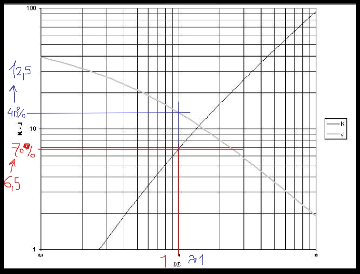
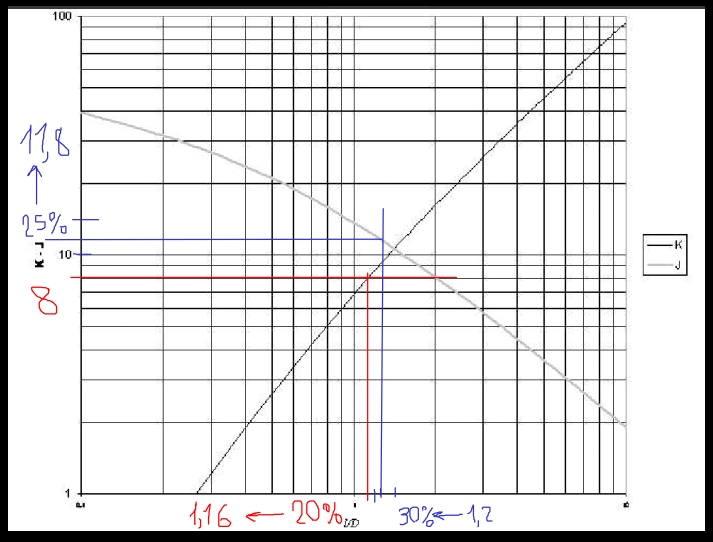
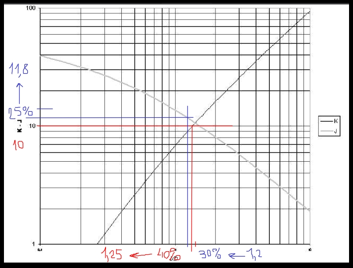
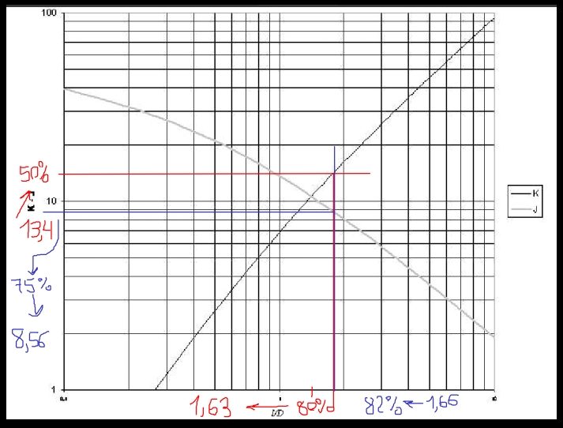
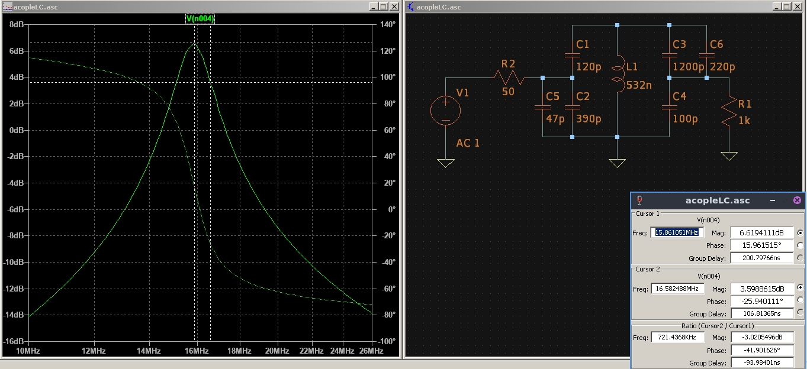

# Resumen teorico
-----------------------------------------------------------
del teorico sabemos que para un circuito RLC paralelo se cumple

$$
\begin{align*}
fo &= \frac{1}{2 \pi \sqrt{LT \cdot CT}}\newline
Qp &= \frac{RT}{2 \pi fo \cdot LT} = \frac{fo}{BW}
\end{align*} 
$$

del teorico sacamos que un circuito RLC paralelo se puede transformar en 

Ra resistencia de antena, Rp resistencia de perdida del inductor

aplicando una reflexion similar a la del auto transformador se simplifica 

de donde sacamos las relaciones

$$
\begin{align*}
RT &= Ra' // (RL' // Rp)\newline
CT &= (C1(s)C2) // (C3(s)C4)
\end{align*} 
$$

y para las impedancias reflejadas

$$
\begin{align*}
Ra' &= Ra \left(1 + \frac{C_{2}}{C_{1}}\right)^{2}\newline
RL' &= RL \left(1 + \frac{C_{4}}{C_{3}}\right)^{2}
\end{align*}
$$

con lo que la entrada y salida quedan adaptadas

con estas igualdades calculamos todos los capacitores y diseñamos la inductancia para cumplir con los requerimientos

$$
\begin{align*}
Ra' &= RL'//Rp = 2RT\newline
C1(s)C2 &= C3(s)C4 = \frac{CT}{2}
\end{align*}
$$

# Diseño/simulacion
-----------------------------------------------------------

la metodologia para el diseño fue

1. definir diametro de alambre y del nucleo para el inductor

2. calcular inductancia para un K de 6.5

3. calcular capacidad para resonar a la fo, definir esta capacidad para comenzar
* * diseñar el inductor con curva K, sacar numero de espiras
* * comprobar valor con curva J, usar este valor de inductancia
* * calcular resistencia de perdida con ecuaciones de nagaoka

4. con la nueva inductancia, correjir la capacidad total para resonar 

5. calcular resitencia total para cumplir con el BW

6. buscar capacitores C1-4

* * si C3 da negativo, aumentar RT, aumentando LT, disminuir CT y volver al paso 3.

310

250

200

7. con valores validos, simular y comprobar

150

* * normalizar a valores comerciales, sacar capacidad total, cambiar valor de inductancia y volver al paso3.

169

8. simular con valores comerciales ajustados

con las relaciones anteriores se obtienen las ecuaciones para diseño

para los capacitores C1 y C2

$$
\begin{align*}
C_{2} &= \frac{CT}{2} \sqrt{\frac{2RT}{Ra}}\newline
C_{1} &= \frac{C_{2}}{\sqrt{\frac{2RT}{Ra}} - 1}\newline
\end{align*}
$$

y para C3 y C4

$$
\begin{align*}
C_{4} &= \frac{CT}{2} \sqrt{\frac{RL'}{RL}}\newline
C_{3} &= \frac{C_{4}}{\sqrt{\frac{RL'}{RL}} - 1}\newline
RL' &= \frac{2 RT}{1 - \frac{2 RT}{Rp}}
\end{align*}
$$

se realizo un script en python para hacer los calculos de componentes y hacer el diseño del inductor usando el metodo de nagaoka

finalmente se implemento con

inductor:
* 0.532 uH aprox.
* 10 espiras y diametro de cobre 1.2 mm
* nucleo de 1 cm, largo de 1.7 cm aprox. 

capacitores:
* C1=120pF, C2=(390//47)pF, C3=1.5nF y C4=100pF.
* capacidad total con valores normalizados 188pF aprox.
-----------------------------------------------------------

# Armado
-----------------------------------------------------------
pcb de 5x10cm, diseño con marcador, se estañan las pistas y agregan los conectores BNC para entrada y salida

posibilidad de conectar/desconectar Cx, Rx, RL y puentear punto de insercion y salida

-----------------------------------------------------------

# Mediciones

setup
* generador 2 Vpp, imp de salida 50 Ohm

## frecuencia de resonancia
medimos en el riel de arriba para simplificar todas las ecuaciones
es medicion indirecta debido a la capacidad parasita del osc que nos cambia la frecuencia de resonancia

sacamos fo1 midiendo sin Cx y fo2 agregando Cx

como

$$
\begin{align*}
fo1 &= \frac{1}{2 \pi \sqrt{LT \cdot (CT+Cosc)}}\newline
fo2 &= \frac{1}{2 \pi \sqrt{LT \cdot (CT+Cosc+Cx)}}
\end{align*} 
$$

> dividiendo miembro a miembro y llamando k a la relacion fo1/fo2

$$
\begin{align*}
CT + Cosc = \frac{Cx}{k^2 - 1}
\end{align*} 
$$

que la llamamos A y la reemplazamos en la ecuacion de fo1 y obtenemos LT como

$$
\begin{align*}
LT = \frac{1}{(2 \pi fo1)^2 \cdot A}
\end{align*} 
$$

para la medicion

fo1=12.34MHz
fo2=9.87MHz
LT=0.520uH (err% = 2.2%)

reemplazando en la ecuacion para resonancia

fo=16.1MHz

## Q descargado

en resonancia y sin carga se agrega Rx, cambia los puntos de medicion y entrada, y se mide vi y vo

luego como

$$
\begin{align*}
vo = vi \frac{Rp}{Rp + Rx},\quad despejamos\quad
Rp = \frac{Rx}{\frac{vi}{vo}-1}
\end{align*} 
$$

finalmente para el Q descargado

$$
\begin{align*}
Qdesc &= \frac{Rp}{2 \pi fo \cdot LT}
\end{align*} 
$$

midiendo

fo=12.34MHz
vi=2 Vpp
vo=0.49 Vpp
Rp=4k87 Ohm

Qdesc=120

## imp de salida

## imp de entrada
 
## bw y respuesta

-----------------------------------------------------------

<!---
Insertar latex en pdf
--->

