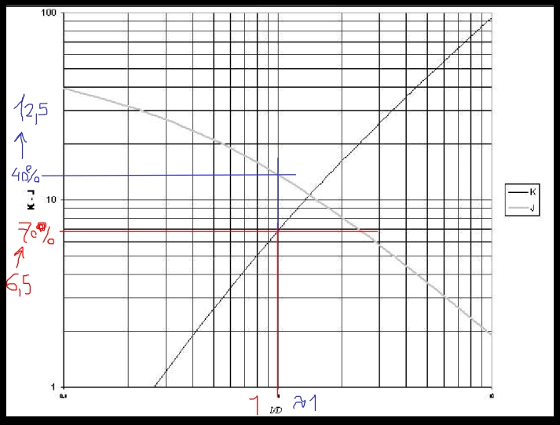
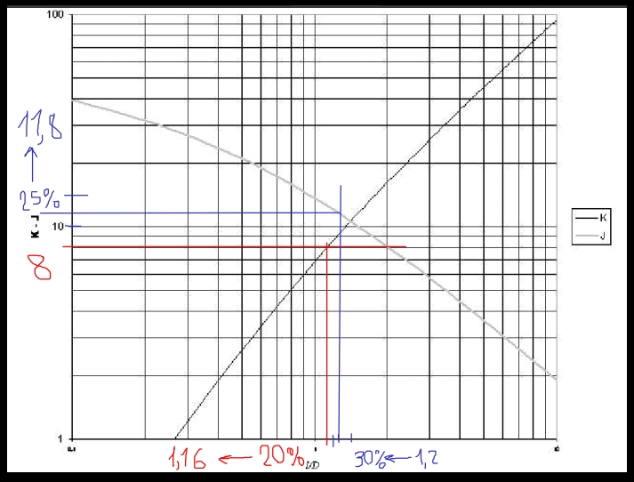
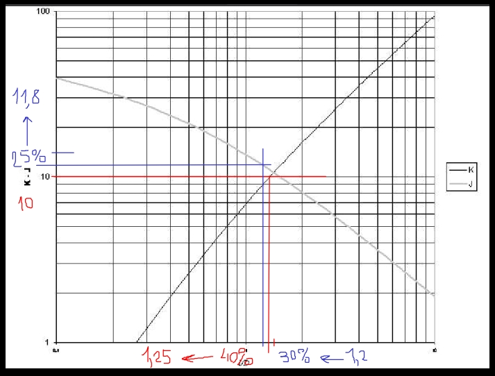
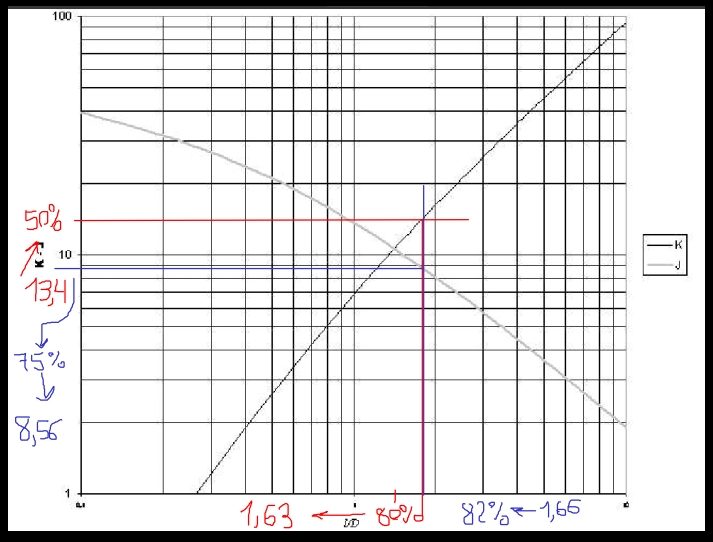
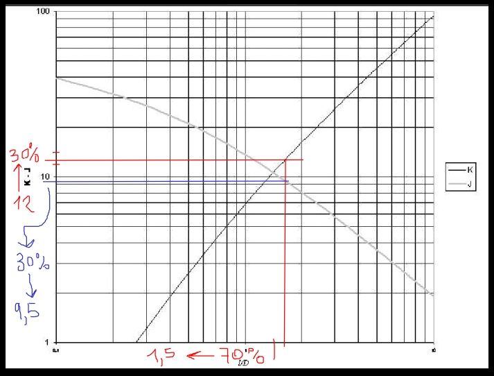
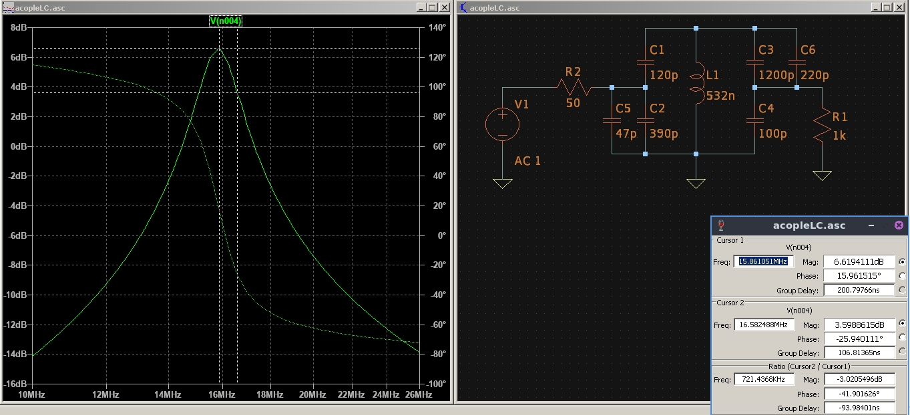

# metodo

* definir diametro de alambre y del nucleo para el inductor
* calcular inductancia para un K de 6.5
* con la inductancia, calcular capacidad para resonar a la fo
* definir esta capacidad para comenzar
* diseñar el inductor con curva K, sacar numero de espiras
* comprobar valor con curva J, usar este valor de inductancia
* con la nueva inductancia, correjir la capacidad total para resonar 
* calcular resistencia de perdida con ecuaciones de nagaoka
* calcular resitencia total para cumplir con el BW
* buscar capacitores C1-4

* si C3 da negativo, aumentar RT, aumentando LT, disminuir CT e iterar nuevamente

310

250

200

* con valores validos, simular y comprobar

150

* normalizar a valores comerciales, sacar capacidad total, cambiar valor de inductancia y volver a iterar

169

* simular con valores comerciales

