# FCEFyN - UNC - ELECTRÓNICA INDUSTRIAL
## DOCENTE: Prof. Esp. Ing. Adrián Claudio Agüero
## ALUMNO: Ferraris Domingo Jesus

---------------------------------------
---------------------------------------

# Trabajo practico teorico 1: 
## Introduccion a la electronica de potencia.

-----------------------------------------

## Sistema elegido.
Fuente conmutada monofasica ***Thermaltake TR2-450W.***
* ***Valores de entrada:*** 115-220V AC, monofasica, 47-50Hz.
* ***Salidas:*** 3.3V, 5V, 12V DC, corrientes maximas de 22A, 18A y 18A correspondiente a cada salida.

Se identifican las siguientes etapas en la placa del sistema:

### Diagrama en bloques.

Diagrama en bloques de sistema simplificado:

El sistema se compone por:

* **Protecciones/Fitro de red**

Aca se encuentran dispositivos de seguridad como ***fusibles y varistores*** para proteger contra sobre corriente/tension. 
Luego el filtro de red esta compuesto principalmente por un ***inductor choque y capacitores***, se encarga de filtrar ruidos de alta frecuencia presentes en la señal de red.

* **Rectificacion/filtro**

Compuesto por un ***puente rectificador monofasico de onda completa, capacitores y resistencias*** que se encargan de generar una continua de alta tension (311V aprox.).

Vemos las señales de la salida del filtro de red, la rectificada monofasica de onda completa (si el capacitor de filtrado no existiera) y la tension continua pusante a la salida de la etapa.

* **Control de PWM**

Es el principal bloque del sistema, se encarga de ***generar una señal de PWM para controlar los drivers de los transistores de potencia*** en la etapa de switching.
Sensa los niveles de tension en la salida de la fuente y genera una señal de PWM con un duty cycle proporcional a dichos niveles. Por tanto si aumenta la carga y disminuye la tension de salida, este controlador aumenta el duty cycle y esto hace subir la tension de salida manteniendo la misma estable.
En este sistema el control se implementa con el ***IC WT7520.***

* **Switching/Transformador**

Con el PWM se comanda los ***transistores de potencia E13007***, que junto con un diodo y el primario del transformador generan una tension alterna de alta frecuencia (arriba de 22KHz) que se aplica al bobinado primario, cuyo valor eficaz es proporcional al duty cycle de la señal de control.
La tension aplicada aparece disminuida en los distintos secundarios, que luego se filtraran para dar las tensiones de salida necesarias.

El sistema se basa en un convertidos ***DC-DC tipo Flyback***, donde si suponemos variacion lineal de la corriente, por ley de faraday, se pueden dibujar estas formas de onda aproximadas para el primario y secundario del transformador.

* **Rectificado/Filtrado de salida**

Seguidamnete se rectifican las tensiones del secundario con un ***puente rectificador monofasico de media onda implementados con diodos Schotkky MBR30-45PT*** que recorta los semiciclos negativos.
Finalmente se filtra la tension por medio de ***filtros Choque/RC*** para obtener la continua pulsante de las distintas salidas.

Donde vo es de bajo ripple y corresponde a 3.3V, 5V o 12V segun la salida.

----------------------------------------------------

## Componentes de potencia

El sistema usa un ***puente rectificador monofasico de onda completa KBU606:***

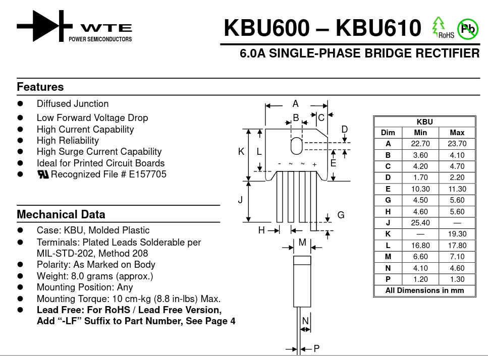

Se observan tensiones inversas repetitivas de 600V y 420V eficaces. Por el lado de la corriente tiene una corriente media maxima de 6A y una no repetitiva de 250A.
Ademas se indica una temperatura maxima de juntura de 150°C.

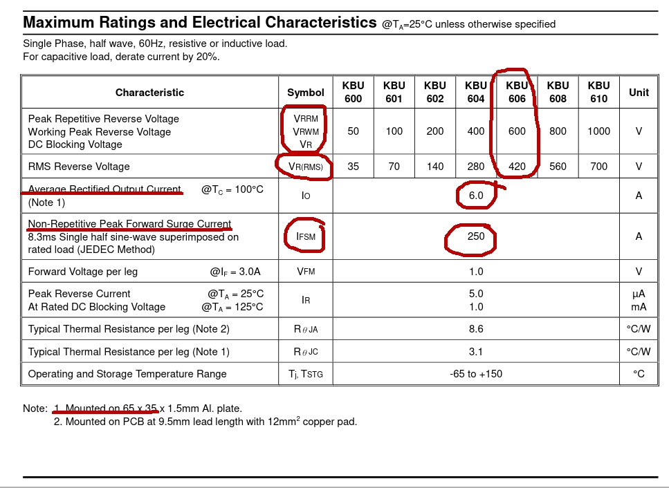

Para la parte de switching tenemos el ***transistor bipolar de potencia E13007:***

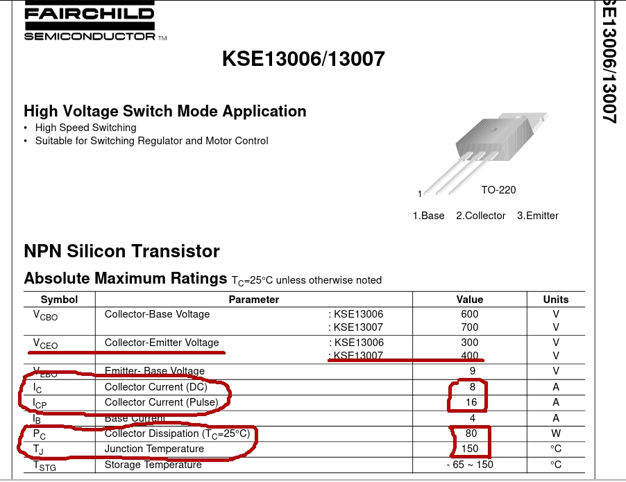

Tiene una tension maxima de colector-emisor de 400V, corriente de colector maxima de 8A (16A de pulso) y una potencia maxima de 80W.
Ademas tiene una VCE de saturacion de 3V como maximo y una VBE maxima en saturacion de 1.6V.

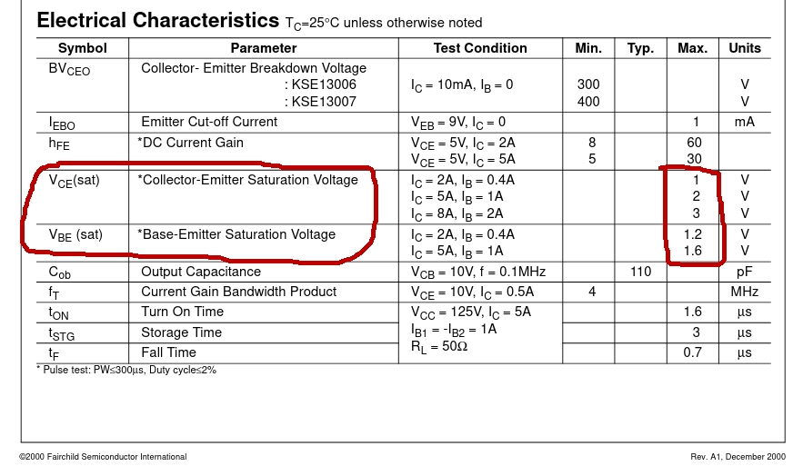

Para la rectificacion en alta frecuencia se usan los ***diodos schottky de potencia MBR30-45PT:***

Con ***encapsulado TO-3P*** y en configuracion de ***catodo comun.***

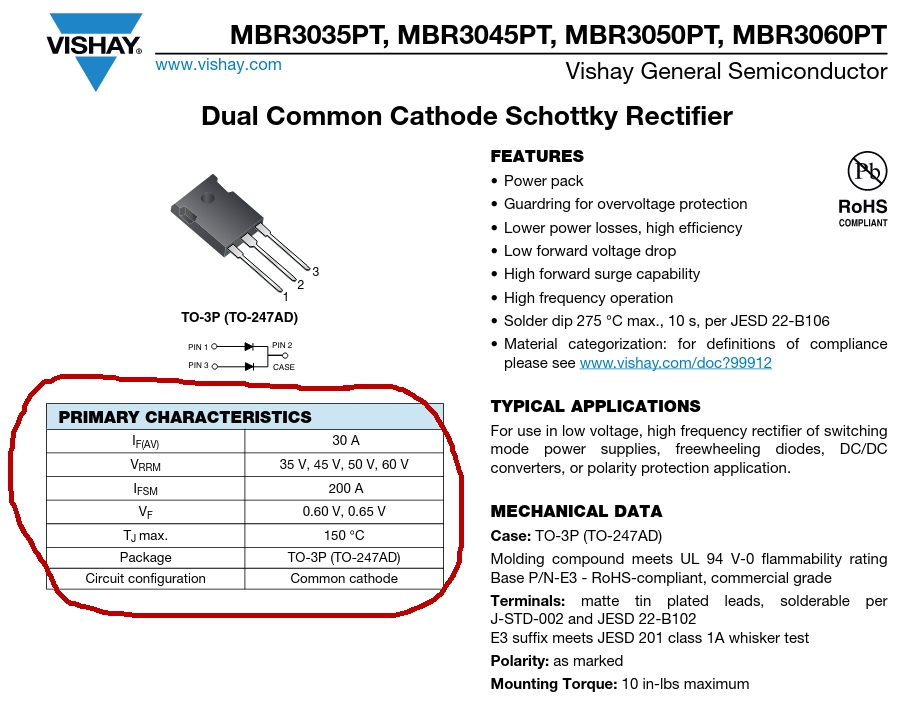

Tienen una tension inversa repetitiva maxima de 45V, una corriente media repetitiva de 30A y de 200A no repetitiva.

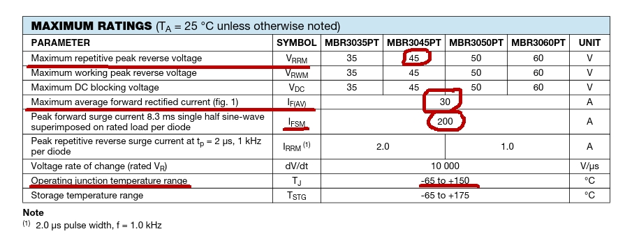

--------------------------------------------

## Formas de onda simuladas

Usando ***LTSpice*** simulamos el circuito del sistema simplificado utilizando diodos de rectificacion y schottky, y un transistor NPN para la etapa de switching.

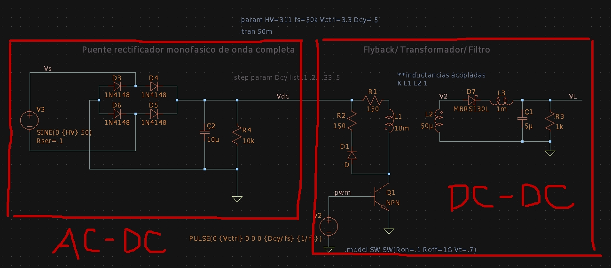

* **Coversor AC-DC**

Se puede ver la forma de onda monofasica, previamente filtrada por el filtro de red, y la continua pulsante de alta tension a la salida, que alimentara al Flyback.

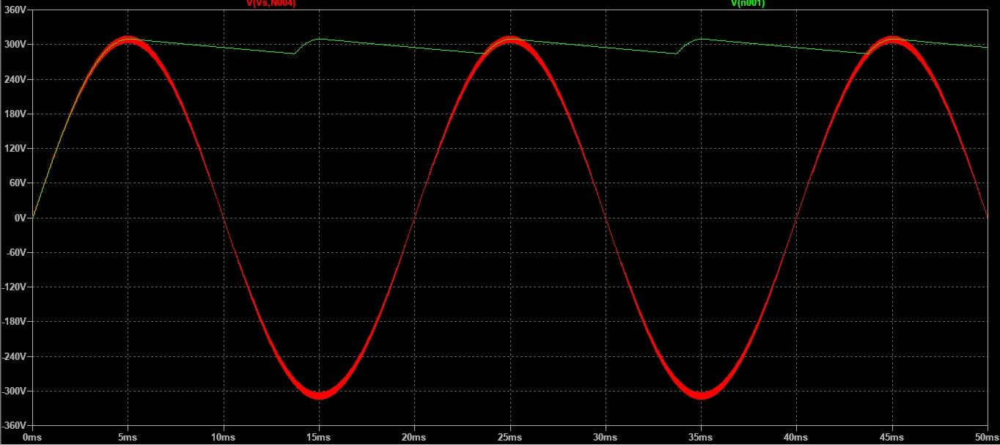

* **Conversor DC-DC**

Durante el estado estable de la tension de salida, se ven (de abajo hacia arriba) las señales de pwm, la corriente por el primario del transformador, la tension en el primario y la disminuida del secundario, y la tension sobre carga luego del filtrado.

Vemos como al aumentar la corriente de colector, se genera una tension sobre el primario proporcional a la derivada de la corriente. Esta tension aparece disminuida en el secundario segun la relacion de espiras del transformador.

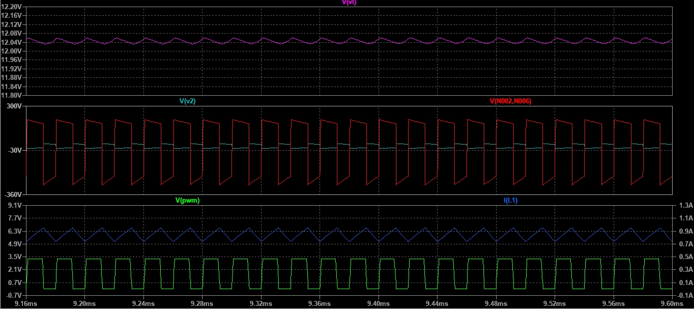

Ademas se simulo el cambio de la tension de salida para un PWM con duty cycle de 10, 25, 33 y 50%.

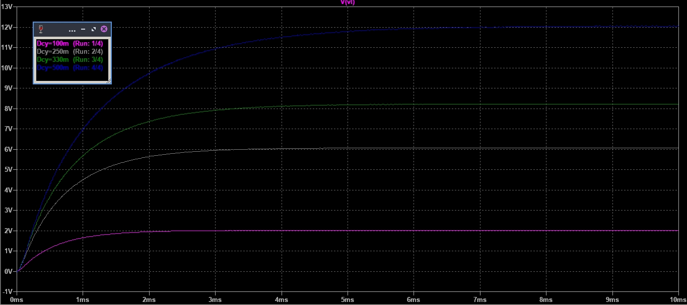

----------------------------------------------

## Sistema elegido

Inversor de salida cuadrada 12VDC/230VAC basado en NE555.
* Valores de entrada: 12VDC
* Salida: 230VAC, monofasica, 50Hz, 500mA max, 115W.

### Diagrama en bloques

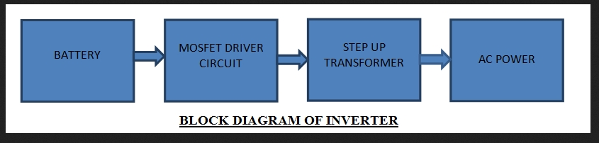

Un inversor basico toma tension continua de una bateria y por medio de un ***oscilador de onda cuadrada*** comanda transistores de potencia que generan tension en los bobinados secundarios de un ***transformador con punto medio***.
Dichas tensiones aparecen elevadas en fase y contra fase en el primario, donde por superposicion se obtiene una señal ***alterna cuadrada monofasica de alta tension.***

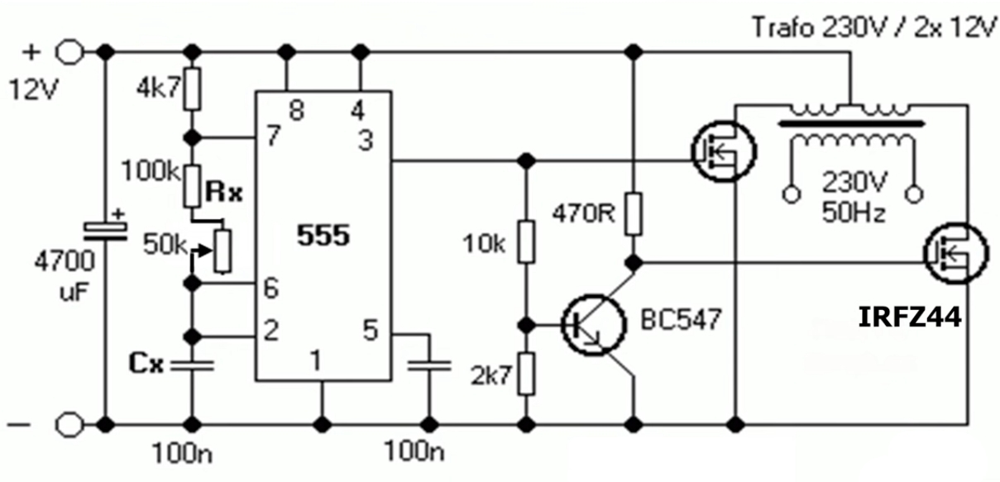

* **Oscilador**

Esta implementado con ***IC NE555*** que genera la señal cuadrada de 50Hz. Un transistor ***BC547*** para invertir la señal generada por el 555, de esta forma se logra hacer trabajar a los MOSFETS alternadamente.

* **Switching**

Par de ***MOSFETS de potencia IRFZ44*** que se encargan de hacer circular corriente por los secundarios del transformador de forma alternada entre uno y otro.

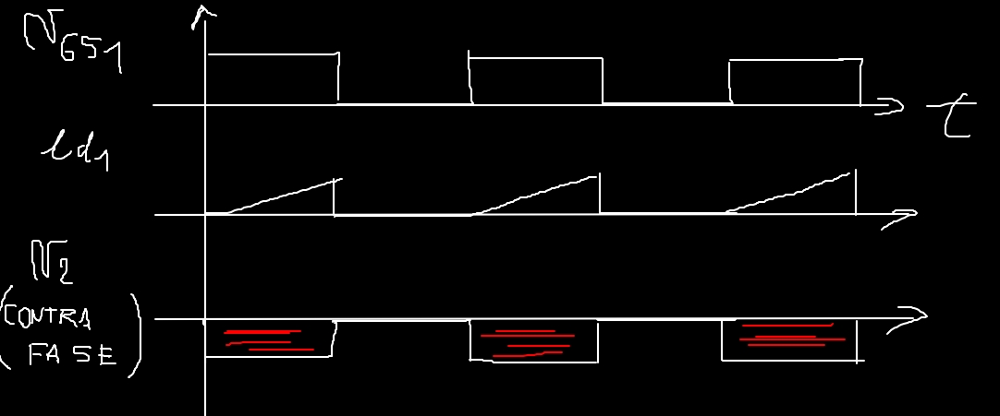

Si uno de los MOS hace variar la corriente del ***bobinado secundario en contra fase***, por ley de faraday se genera una tension proporcional y opuesta a la derivada de la corriente. Esta misma aparece invertida y elevada en el primario del transformador formando el ***semiciclo positivo de salida.***

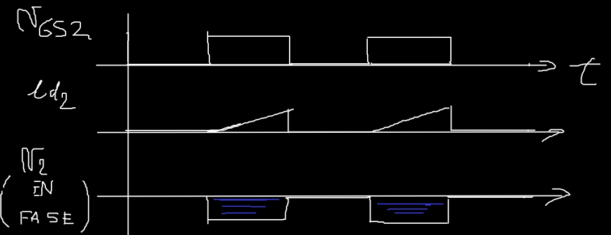

Por el contrario cuando el otro MOS hace variar de forma opuesta la corriente del ***bobinado secundario en fase***, se genera una tension que aparece elevada en el primario del transformador formando ahora el ***semiciclo negativo de salida.***

* **Transformador**

Transformador elevador con punto medio donde las tensiones en fase y contra fase de los bobinados primarios ***se superponen para obtener una onda cuadrada alterna*** monofasica de alta tension pero baja corriente.

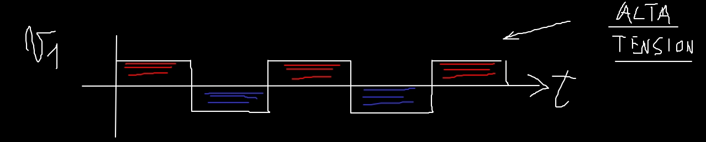

----------------------------------

## Componentes de potencia

El sistema solo tiene el ***MOSFET de potencia IRFZ44:***

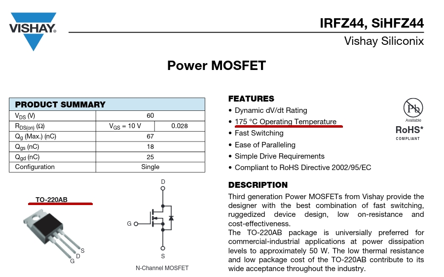

En el ecapsulado TO-220AB, y se observa una temperatura maxima de juntura de 175°C.

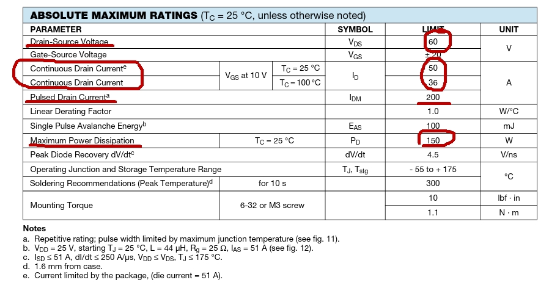

Ademas tiene una VDS maxima de 60V y una IDS maxima de 50A a 25°C que decae a 36A a los 100°C. Tambien se observa una corriente de pulso maxima de 200A.

Por ultimo puede disipar una potencia maxima de 150W.

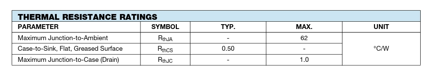

Tambien se cuenta con las resistencias termicas para el diseño de disipadores.

