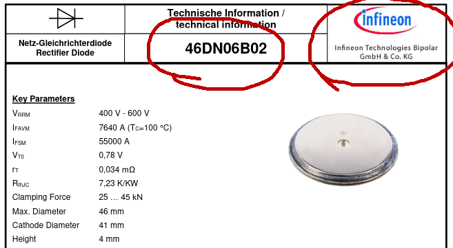

# FCEFyN - UNC - ELECTRÓNICA INDUSTRIAL
## DOCENTE: Prof. Esp. Ing. Adrián Claudio Agüero
## ALUMNO: Ferraris Domingo Jesus

---------------------------------------
---------------------------------------

# Trabajo practico teorico 2: 
## Diodos de potencia.

-----------------------------------------

## Diodo elegido.
Diodo rectificador de potencia ***46DN06B02.***
* Fabricante: Infineon Technologies Bipolar.
* Aplicaciones: Soldaduras, rectificacion para circuitos galvanicos, rectificacion de alta corriente.

### Caracteristicas electricas.

* IF(av)M: 10.45KA a una temperatura de operacion de 55°C decayendo a 7.74KA operando a 100°C, ambas durante un tiempo de 10ms.
* IFRMS: 16.4KA a una temperatura de operacion de 55°C decayendo a 12.2KA operando a 100°C, ambas durante un tiempo de 10ms.
* IFSM: 55KA a una temperatura de juntura de 25°C decayendo a 48KA con temperatura de juntura maxima (180°C), ambas durante un tiempo de 10ms.
* VRRM = VRRW: 600V para temperatura de juntura de -40 a 180°C.
* Energia I2T: 15.125K(A^2)s a una temperatura de juntura de 25°C decayendo a 11.52K(A^2)s a temperatura de juntura maxima.
* Tension de umbral 0.7 a 0.78V y caida de tension maxima: 0.98V, con temperatura de juntura maxima y corriente de prueba de 6KA.

***Tambien se cuenta con la caracteristica de corriente vs tension:***

### Potencia disipada vs IF(av)

En esta grafica vemos la potencia media maxima admisible vs la corriente media directa de trabajo, colocando disipadores a ambos lados del diodo.

Las parametricas corresponden a corriente continua, senoidal directa aplicada con angulo de conduccion de 180° y rectificando con angulos de conduccion de 30°, 60°, 90°, 120° y 180°.

En cada punto tenemos la potencia maxima disipada para cada valor de corriente media. Los extremos de las curvas corresponden a la maxima potencia admisible para la maxima corriente media ensayada.

### Encapsulado e instalacion

Tiene un encapsulado de tipo disco.

diagrama con rectificador trifasico de onda con carga resistiva, trafo, rec, disipador y carga, instalacion en sanguche disipador-diodo-disipador.

## Simulaciones

conseguido modelos se ven las condiciones de prueba del fabricante

### tipos de diodos
MR850 rectificador de alta corriente y rapida recuperacion

1N4148 diodo de conmutacion de alta velocidad

### circuito test/condiciones

los fabricantes prueban el tiempo de recuperacion con un circuito similar a este

condiciones para el mr

condiciones para el 1n

simulaciones de transitorios on/off

en todos se aplica un pulso a los 100ns, para cambiar el estado de conduccion de los diodos

se nota un importante pico de corriente al entrar en conduccion, triple de la de operacion

tambien se observa pico de corriente pero de menor magnitud

y el tiempo de recuperacion inverso de 150 y 

-------------------------------------
