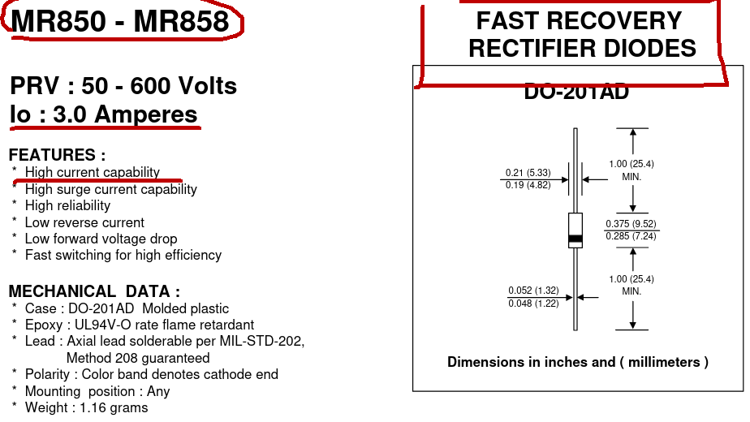

# FCEFyN - UNC - ELECTRÓNICA INDUSTRIAL
## DOCENTE: Prof. Esp. Ing. Adrián Claudio Agüero
## ALUMNO: Ferraris Domingo Jesus

---------------------------------------
---------------------------------------

# Trabajo practico teorico 2: 
## Diodos de potencia.

-----------------------------------------

## 1. Diodo elegido.
Se eligio para el analisis el ***diodo rectificador de potencia 46DN06B02.***
* Fabricante: Infineon Technologies Bipolar.
* Aplicaciones: Soldaduras, rectificacion para circuitos galvanicos, rectificacion de alta corriente.

### Caracteristicas electricas.

Que tiene las siguientes caracteristicas importantes: 

* ***IF(av)M:*** 10.45KA a una temperatura de operacion de 55°C ***decayendo a 7.74KA operando a 100°C***, ambas durante un tiempo de 10ms.
* ***IFRMS:*** 16.4KA a una temperatura de operacion de 55°C ***decayendo a 12.2KA operando a 100°C***, ambas durante un tiempo de 10ms.
* ***IFSM:*** 55KA a una temperatura de juntura de 25°C ***decayendo a 48KA con temperatura de juntura maxima (180°C)***, ambas durante un tiempo de 10ms.
* ***VRRM = VRRW:*** 600V para temperatura de juntura de -40 a 180°C.
* ***Energia I2T:*** 15.125K(A^2)s a una temperatura de juntura de 25°C ***decayendo a 11.52K(A^2)s a temperatura de juntura maxima.***
* ***Tension de umbral 0.7 a 0.78V*** y caida de tension maxima: 0.98V, con temperatura de juntura maxima y corriente de prueba de 6KA.
* Como dato adicional se cuenta con la caracteristica de corriente vs tension.

### Potencia disipada vs IF(av)

En esta grafica vemos la potencia media maxima admisible vs la corriente media directa de trabajo, colocando disipadores a ambos lados del diodo.

Las parametricas corresponden a corriente continua, senoidal directa aplicada con angulo de conduccion de 180° y rectificando con angulos de conduccion de 30°, 60°, 90°, 120° y 180°.

En cada punto tenemos la potencia maxima disipada para cada valor de corriente media. Los extremos de las curvas corresponden a la maxima potencia admisible para la maxima corriente media ensayada.

* leer factor de forma *

------------------------------------

### Encapsulado e instalacion

Tiene un encapsulado de tipo disco.

diagrama con rectificador trifasico de onda con carga resistiva, trafo, rec, disipador y carga, instalacion en sanguche disipador-diodo-disipador.

------------------------------------

## 2. Simulaciones/comparaciones

Se compararon los ***diodos MR850 y 1N4148*** en transitorios de corriente y tension para conduccion/corte. Ademas se compararon los ***tiempos de recuperacion maximos*** de cada uno.

### Tipos de diodos

En los datasheets vemos que el MR850 es un ***diodo rectificador de alta corriente y rapida recuperacion.***

Con un Trr de 150ns, para las ***condiciones de prueba definidas:***
* Estar conduciendo una corriente de 0.5A.
* Pasar al corte con un pico de corriente inversa de 1A.
* Esperar hasta que la corriente inversa alcance los 0.25A.

Por otro lado, el 1N4148 es un ***diodo de baja corriente y conmutacion de alta velocidad.***

Este tiene un Trr de 8ns como maximo, ***para las siguientes condiciones de prueba:***
* Conducir una corriente de 10mA.
* Pasar al corte con un pico de corriente inversa de 10mA.
* Esperar hasta que la corriente inversa alcance 1mA.

### Circuito de test:

Los fabricantes prueban el tiempo de recuperacion inversa con un circuito similar al siguiente:

Que se armo en LTSpice ***colocando tensiones y resistencias de tal forma que se respeten las condiciones de prueba para cada diodo.***

En todos se le ***aplico un pulso a los 100ns***, para cambiar el estado de conduccion de los diodos.

**Analisis MR850:**

Forzando la conduccion al aplicar el pulso de prueba celeste, se nota un importante ***pico de corriente***, en verde, mayor al triple de la corriente de operacion, por lo que hay una ***importante disipacion de energia*** en este caso cercana a los 9W como se ve en la grafica roja:

Forzando el corte vemos el tiempo que tarda el diodo en establecer su caida de tension en azul, cuando el pulso de prueba celeste se aplica, ***el diodo demora en hacer caer toda la tension inversa aplicada***, lo cual genera el pico de corriente inversa de 1A:

Luego al reaccionar el diodo estabilizando su caida de tension y ***bloqueando bruscamente la corriente*** se produce otro pico de energia disipada de casi 2W.

**Analisis 1N4148:**

Forzando la conduccion al aplicar el pulso de prueba celeste, se nota un ***importante pico de corriente*** mayor al triple de la corriente de operacion, por lo que tambien hay un pico de disipacion de energia como se ve en la grafica roja:

En este caso forzando el corte cuando el pulso de prueba celeste se aplica, vemos que el diodo ***establece gradualmente su caida de tension en azul***. Durante esta demora se genera el pico de corriente inversa, pero en este caso ***se recupera mucho mas rapido pero gradualmente*** lo que amortigua el pico de energia disipada que se veia en el MR850:

### Comparacion del tiempo de recuperacion maximo

Tambien se simularon los tiempos de recuperacion respetando las condiciones de prueba para ambos diodos, y ***cortando la conduccion a los 100ns:***

Que nos deja un Trr = 150ns para el MR850, acorde al maximo dado por el fabricante.

Y para el 1N4148 un Trr = 16ns el cual el doble de los 8ns que nos da el fabricante. ***Esto se debe alparametro tt = 20ns del modelo generico usado:***

En efecto bajando este parametro a 10ns se obtiene un Trr acorde al dado por el fabricante del 1N4148:

Pero esto es cambiar el modelo Spice del diodo, por lo que, segun de que fabricante se trate la simulacion puede o no reproducir una situacion real.

-------------------------------------
