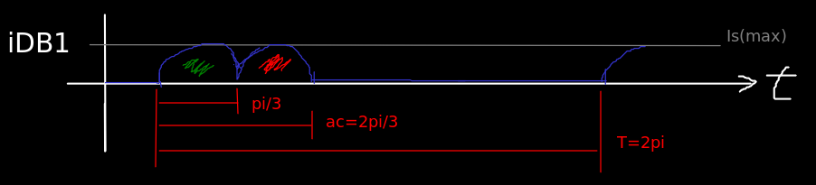
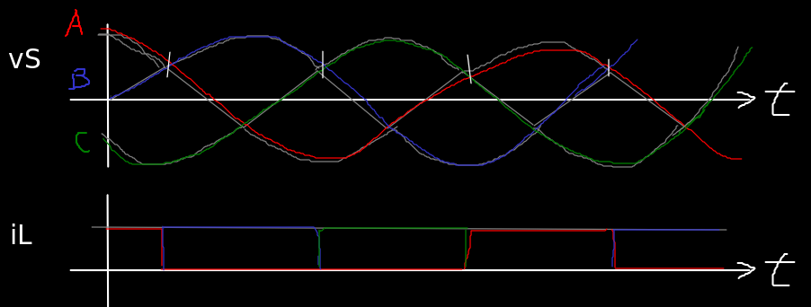
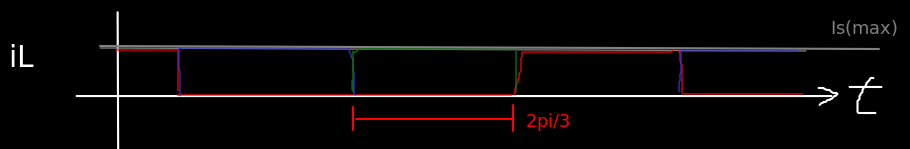
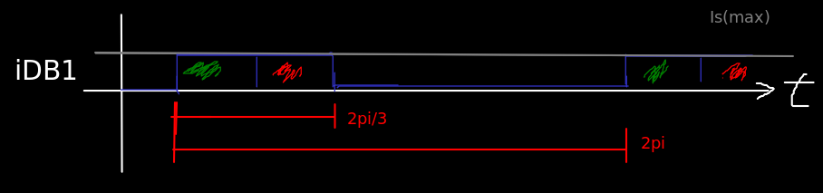

# FCEFyN - UNC - ELECTRÓNICA INDUSTRIAL
## DOCENTE: Prof. Esp. Ing. Adrián Claudio Agüero
## ALUMNO: Ferraris Domingo Jesus

---------------------------------------
---------------------------------------

# Trabajo practico teorico 3: 
## Rectificacion.

-----------------------------------------

## 1. Analisis. 

Se hizo un analisis teorico de un circuito rectificador trifasico de onda completa con carga resistiva pura e inductiva pura. Ademas uniendo los analisis se sacaron conclusiones para una carga resistiva-inductiva.

Para cada caso se pusieron los parametros importantes de los diodos en funcion de las caracteristicas de la carga, siguiendo los siguientes pasos:

* Calcular la corriente media en la carga.
* Calcular corrientes media y eficaz por diodo. 
* Relacionar corriente media y eficaz por diodo con la media de la carga. 
* Calcular la tension media en la carga.
* Relacionar la anterior con la tension de pico inversa por diodo.

Como ya sabemos vamos a aplicar las siguientes integrales para el calculo de valor medio y eficaz.

$$
\begin{align*}
IF(media)=IFav=\frac{1}{T} \int_{-\frac{T}{2}}^{\frac{T}{2}} iD_{(t)} dt \\\\
IF(ef)=IF=\sqrt{\frac{1}{T} \int_{-\frac{T}{2}}^{\frac{T}{2}} (iD_{(t)})^2 dt} \\\\
IL(media)=Io=\frac{1}{T} \int_{-\frac{T}{2}}^{\frac{T}{2}} io_{(t)} dt \\\\
VL(media)=Vo=\frac{1}{T} \int_{-\frac{T}{2}}^{\frac{T}{2}} vo_{(t)} dt
\end{align*}
$$

### Carga resistiva.

Nuestro circuito para el caso de la resistiva pura nos queda:

Donde conducira un diodo por fase y la corrinte retornara por uno de los 2 diodos inferiores alternadamente en cada angulo de conduccion.

Cuando la fase B sea positiva hara entrar en coduccion al diodo B1 y este cerrara el circuito por medio del diodo C2 la mitad del tiempo y A2 la segunda mitad del tiempo.

Durante el tiempo que este no conduzca, estara en inversa y soportara como maximo una tension inversa igual a la tension de linea.

Seguidamente entra en conduccion el diodo C1 y cierra por A2 y B2.

Y por ultimo el diodo C1 que cierra por A2 y B2 repitiendo luego toda la secuencia.

La corriente en la carga sera la superposicion de todas las fases aportadas por los diodos, generando una continua pulsante de periodo igual a la mitad del angulo de conduccion de cada diodo.

#### Calculo de coeficientes

Comenzamos por saber la expresion para la corriente media por la carga basandonos en el grafico analizado y aplicando la definicion de valor medio.

Donde aproximamos los pulsos por cosenos de periodo pi/3, que integramos en el intervalo [-pi/6; pi/6].

> aplicando la definicion de valor medio y con cambio de variable, resolvemos una integral angular:

$$
\begin{align*}
Io=\frac{3}{\pi} \int_{-\frac{\pi}{6}}^{\frac{\pi}{6}} Is_{p} cos(\theta) d\theta
= 3\cdot \frac{Is_{p}}{\pi}
\end{align*}
$$

Continuamos con el valor medio y eficaz por diodo viendo las caracteristicas de la forma de onda de corriente.

Esta tiene un periodo de 2pi, un angulo de conduccion de 2pi/3 conformado por 2 pulsos de corriente, cada uno de duracion pi/3.

En este caso tomamos medio pulso de corriente, aproximamos por coseno, e integramos en un intervalo simetico +/- pi/6.Finalmente multiplicamos por 2 para tener el valor medio de el pulso completo.

$$
\begin{align*}
IFav=2\cdot[\frac{1}{2\pi} \int_{-\frac{\pi}{6}}^{\frac{\pi}{6}} Is_{p} cos(\theta) d\theta] 
= \frac{Is_{p}}{\pi }
\end{align*}
$$

> dividiendo miembro a miembro (m2m) IFav e Io, despejando IFav tenemos:
$$
\begin{align*}
\mathbf{IFav = \frac{1}{3} \cdot Io = Kav \cdot Io} 
\end{align*}
$$

Y para el valor eficaz:

$$
\begin{align*}
IF^2 &= 2\cdot [\frac{1}{2\pi} \int_{-\frac{\pi}{6}}^{\frac{\pi}{6}} [Is_{p} cos(\theta)]^2 d\theta]
= \frac{2\pi+3\sqrt{3}}{12\pi} \cdot (Is_{p})^{2} \\\\ 
IF &= \sqrt{\frac{2\pi+3\sqrt{3}}{12\pi}} \cdot Is_p
= A \cdot Is_p
\end{align*} 
$$

> dividiendo m2m IF e Io, y despejando IF: 

$$
\begin{align*}
IF = \frac{\pi}{3} \cdot A \cdot Io
= \frac{\pi}{3}\cdot \sqrt{\frac{2\pi+3\sqrt{3}}{12\pi}} \cdot Io \\\\
\end{align*}
$$

> Finalmente:
$$
\begin{align*}
\mathbf{IF = 0.578 \cdot Io = Krms \cdot Io}
\end{align*}
$$

Continuamos con la tension media sobre la carga aplicando la definicion del valor medio, y teniendo en cuenta que sobre la carga cae la tension entre lineas.

$$
\begin{align*}
Vo=\frac{3}{\pi} \int_{-\frac{\pi}{6}}^{\frac{\pi}{6}} VL_p cos(\theta) d\theta
= \frac{3}{\pi} \cdot VL_p
\end{align*}
$$

> como en este circuito se tiene una tension inversa en los diodos igual a la tension de linea maxima:

$$
\begin{align*}
Vo = \frac{3}{\pi} \cdot V_{RRM} \\\\
\end{align*}
$$

> despejando la tension de pico inversa:
$$
\begin{align*}
\mathbf{V_{RRM} = \frac{\pi}{3} \cdot Vo = 1.047 \cdot Vo = K_{RRM} \cdot Vo}
\end{align*}
$$

Con lo cual tenemos las corrientes y tensiones de calculo importante en funcion de la corriente y tension necesaria en la carga.

### Carga inductiva.

El circuito analizado es el siguiente:

En este caso con carga inductiva ideal, viendo hacia la carga se tiene una impedancia muy grande para la corriente de señal, por lo tanto esta es nula.
Lo que implica que solo hay corriente continua por los diodos en forma de pulsos cuadrados de periodo 2pi.

Luego la carga superpone todos los pulsos obteniendo una continua pura (en el caso ideal).

#### Calculo de coeficientes

Como la corriente en la carga en este caso es continua, buscamos su valor medio durante un angulo de conduccion:

$$
\begin{align*}
Io = \frac{3}{2\pi} \int_{-\frac{\pi}{3}}^{\frac{\pi}{3}} Is_{p} d\theta
= \frac{3}{2\pi} \cdot \frac{2\pi}{3} Is_{p} = Is_{p}
\end{align*}
$$

Luego para las corrientes por diodo tomamos un pulso de corriente, aproximamos por rectangulos de base 2pi/3 y altura Isp (pico).

> aplicando deficion de valor medio, tenemos:

$$
\begin{align*}
IFav = \frac{1}{2\pi} \int_{-\frac{\pi}{3}}^{\frac{\pi}{3}} Is_{p} d\theta
= \frac{1}{2\pi} \cdot \frac{2\pi}{3} \cdot Is_{p} 
= \frac{1}{3} \cdot Is_{p} 
\end{align*}
$$

> como Is(max) es igual a Io, tenemos:
$$
\begin{align*}
\mathbf{IFav = \frac{1}{3} \cdot Io = Kav \cdot Io} 
\end{align*}
$$

Seguidamente para el valor eficaz por diodo:

$$
\begin{align*}
IF^2 &= \frac{1}{2\pi} \int_{-\frac{\pi}{3}}^{\frac{\pi}{3}} (Is_{p})^2 d\theta
= \frac{1}{2\pi} \cdot \frac{2\pi}{3} \cdot (Is_{p})^{2} 
= \frac{1}{3} \cdot (Is_{p})^{2} 
\end{align*} 
$$

> tomando raiz cuadrada, tenemos: 
$$
\begin{align*}
\mathbf{IF = \frac{1}{\sqrt{3}} \cdot Io = Krms \cdot Io}
\end{align*}
$$

Y para la tension media sobre la carga durante un angulo de conduccion:

$$
\begin{align*}
Vo=\frac{3}{2\pi} \int_{-\frac{\pi}{3}}^{\frac{\pi}{3}} VL_p d\theta
= \frac{3}{2\pi} \cdot \frac{2\pi}{3} \cdot VL_{p} 
= VL_{p} 
\end{align*}
$$

Tenemos sobre la carga como valor medio justamente la tension entre lineas.

> y como en este circuito la tension pico inversa es la tension de linea:
$$
\begin{align*}
\mathbf{V_{RRM} =  Vo = K_{RRM} \cdot Vo}
\end{align*}
$$

Con lo cual tenemos las corrientes y tensiones de calculo importante en funcion de la corriente y tension necesaria en la carga.

------

conclusion de una carga RL

-----------

## 1. Simulaciones.

-------------------------------------
-------------------------------------

<!---
Insertar latex en pdf
--->

