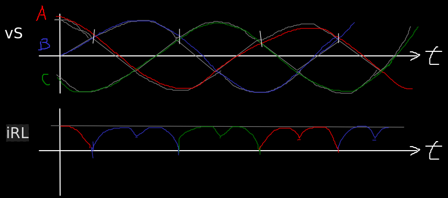
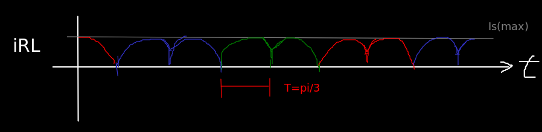
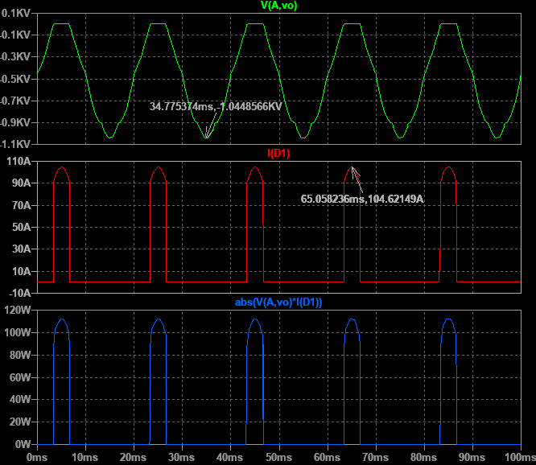

# **FCEFyN - UNC - ELECTRÓNICA INDUSTRIAL**
## DOCENTE: Prof. Esp. Ing. Adrián Claudio Agüero
## ALUMNO: Ferraris Domingo Jesus

---------------------------------------
---------------------------------------

# **Trabajo practico teorico 3:** 
## Rectificacion.

-----------------------------------------

## **1. Analisis.** 

Se hizo un analisis teorico de un circuito ***rectificador trifasico de onda completa con carga resistiva pura e inductiva pura.*** 
Ademas uniendo los analisis se sacaron ***conclusiones para una carga resistiva-inductiva.***

Para cada caso se pusieron los parametros importantes de los diodos en ***funcion de las caracteristicas de la carga***, siguiendo los siguientes pasos:

* Calcular la ***corriente media en la carga (Io).***
* Calcular ***corrientes media (IFav) y eficaz (IF) por diodo.***
* ***Relacionar corrientes*** media y eficaz por diodo con la media de la carga. 
* Calcular la ***tension media en la carga (Vo).***
* Relacionar la anterior con la ***tension de pico inversa por diodo (VRRM).***

Como ya sabemos vamos a aplicar las siguientes integrales para el ***calculo de valor medio y eficaz.***

$$
\begin{align*}
IF(media)=IFav=\frac{1}{T} \int_{-\frac{T}{2}}^{\frac{T}{2}} iD_{(t)} dt \\\\
IF(ef)=IF=\sqrt{\frac{1}{T} \int_{-\frac{T}{2}}^{\frac{T}{2}} (iD_{(t)})^2 dt} \\\\
IL(media)=Io=\frac{1}{T} \int_{-\frac{T}{2}}^{\frac{T}{2}} io_{(t)} dt \\\\
VL(media)=Vo=\frac{1}{T} \int_{-\frac{T}{2}}^{\frac{T}{2}} vo_{(t)} dt
\end{align*}
$$

### **Carga resistiva.**

Nuestro circuito para el caso de la resistiva pura nos queda:

Donde conducira un diodo por fase y ***la corrinte retornara por uno de los 2 diodos inferiores alternadamente*** en cada angulo de conduccion.

Se analiza la secuencia para sacar las formas de onda de corrientes y tension inversa:

Cuando la fase B sea positiva hara entrar en coduccion al diodo B1 y este cerrara el circuito por medio del diodo C2 la primer mitad del tiempo y A2 la segunda mitad del tiempo.

Durante el tiempo que B1 no conduzca, estara en inversa y soportara como maximo una ***tension inversa igual a la tension de linea.***

Seguidamente entra en conduccion el diodo C1 y cierra por A2 y B2.

Y por ultimo el diodo A1 que cierra por B2 y C2 repitiendo luego toda la secuencia.

La corriente en la carga sera la ***superposicion de todas las fases*** aportadas por los diodos, generando una ***continua pulsante hexafasica.***

#### **Calculo de coeficientes**

Comenzamos por saber la expresion para la ***corriente continua en la carga (Io)*** basandonos en el grafico analizado y aplicando la definicion de valor medio.

Donde la corriente es continua pulsante y aproximamos los pulsos por cosenos de periodo pi/3, que integramos en el intervalo simetrico +/- pi/6.

> aplicando la definicion de valor medio y con cambio de variable, resolvemos una integral angular:

$$
\begin{align*}
Io=\frac{3}{\pi} \int_{-\frac{\pi}{6}}^{\frac{\pi}{6}} Is_{p} cos(\theta) d\theta
= 3\cdot \frac{Is_{p}}{\pi}
\end{align*}
$$

Continuamos con el ***valor medio y eficaz por diodo (IFav e IF)*** viendo las caracteristicas de la forma de onda de corriente.

Esta tiene un periodo de 2pi, un angulo de conduccion de 2pi/3 conformado por 2 pulsos de corriente, cada uno de duracion pi/3.

En este caso un pulso de corriente, aproximamos por coseno, e integramos en un intervalo simetico +/- pi/6.
Finalmente multiplicamos por 2 para tener el valor medio completo.

$$
\begin{align*}
IFav=2\cdot[\frac{1}{2\pi} \int_{-\frac{\pi}{6}}^{\frac{\pi}{6}} Is_{p} cos(\theta) d\theta] 
= \frac{Is_{p}}{\pi }
\end{align*}
$$

> dividiendo miembro a miembro (m2m) IFav e Io, despejando IFav tenemos:
$$
\begin{align*}
\mathbf{IFav = \frac{1}{3} \cdot Io = Kav \cdot Io} 
\end{align*}
$$

Y para el valor eficaz:

$$
\begin{align*}
IF^2 &= 2\cdot [\frac{1}{2\pi} \int_{-\frac{\pi}{6}}^{\frac{\pi}{6}} [Is_{p} cos(\theta)]^2 d\theta]
= \frac{2\pi+3\sqrt{3}}{12\pi} \cdot (Is_{p})^{2} \\\\ 
IF &= \sqrt{\frac{2\pi+3\sqrt{3}}{12\pi}} \cdot Is_p
= A \cdot Is_p
\end{align*} 
$$

> dividiendo m2m IF e Io, y despejando IF: 

$$
\begin{align*}
IF = \frac{\pi}{3} \cdot A \cdot Io
= \frac{\pi}{3}\cdot \sqrt{\frac{2\pi+3\sqrt{3}}{12\pi}} \cdot Io \\\\
\end{align*}
$$

> Finalmente:
$$
\begin{align*}
\mathbf{IF = 0.578 \cdot Io = Krms \cdot Io}
\end{align*}
$$

Continuamos con la ***tension media sobre la carga (Vo)*** aplicando la definicion del valor medio, teniendo en cuenta que sobre la carga cae la tension entre lineas y tiene ***FO identica a la de la corriente.***

$$
\begin{align*}
Vo=\frac{3}{\pi} \int_{-\frac{\pi}{6}}^{\frac{\pi}{6}} VL_p cos(\theta) d\theta
= \frac{3}{\pi} \cdot VL_p
\end{align*}
$$

> como en este circuito se tiene una tension inversa en los diodos igual a la tension de linea maxima:

$$
\begin{align*}
Vo = \frac{3}{\pi} \cdot V_{RRM} \\\\
\end{align*}
$$

> despejando la tension de pico inversa:
$$
\begin{align*}
\mathbf{V_{RRM} = \frac{\pi}{3} \cdot Vo = 1.047 \cdot Vo = K_{RRM} \cdot Vo}
\end{align*}
$$

Con lo cual tenemos las ***corrientes y tensiones de calculo importante en funcion de la corriente y tension necesaria en la carga.***

Para la ***potencia del secundario*** primero analizamos las FO de la corriente por fase, luego calculamos su valor eficaz. Como esto queda en funcion de la corriente pico de la fase podemos relacionarla con la corriente media en la carga.

Finalmente sacamos la potencia aparente del secundario como 3 veces la aparente de una fase (3 * Vs * Is).

Para este circuito ***la corriente por fase es bi-direccional***, por ejemplo, cuando la tension de la fase B es la mas alta, conduce el diodo B1 generando ***2 pulsos de corriente directa***. Pero ademas al conducir A1 o C1 ***cerraran parte de su tiempo de conduccion por DB2***, esto genera ***2 pulsos mas de corriente inversa por la fase B.***

> superponiendo todos los efector tenemos la corriente del secundario por fase B:

Esta es de periodo 2pi, con 4 pulsos en total, 2 pulsos negativos y 2 pulsos positivos, que duran medio angulo de conduccion cada uno.

> calculando el valor eficaz de la corriente de una fase:

$$
\begin{align*}
Is^2 &= 4\cdot [\frac{1}{2\pi} \int_{-\frac{\pi}{6}}^{\frac{\pi}{6}} [Is_{p} cos(\theta)]^2 d\theta]
= \frac{2\pi+3\sqrt{3}}{6\pi} \cdot (Is_{p})^{2} \\\\ 
Is &= \sqrt{\frac{2\pi+3\sqrt{3}}{6\pi}} \cdot Is_p
= B \cdot Is_p
\end{align*} 
$$

> recordando del analisis anterior que:

$$
\begin{align*}
Io = 3\cdot \frac{Is_{p}}{\pi}
\end{align*}
$$

> dividiendo m2m y despejando Is:

$$
\begin{align*}
Is &= B \cdot \frac{\pi}{3} \cdot Io 
= \sqrt{\frac{2\pi+3\sqrt{3}}{6\pi}} \cdot \frac{\pi}{3} \cdot Io \\\\
&\mathbf{\quad Is = 0.817 \cdot Io}
\end{align*} 
$$

Luego sabiendo que la VRRM es la tension entre lineas podemos relacionar el valor eficaz de la fase con la Vo.

$$
\begin{align*}
V_{RRM} =  VLp = \sqrt{3} \cdot Vsp 
= \sqrt{3} \cdot \sqrt{2} \cdot Vs = 
\mathbf{\sqrt{6} \cdot Vs = \frac{\pi}{3} \cdot Vo}
\end{align*}
$$

> despejando Vs tenemos:

$$
\begin{align*}
\mathbf{Vs = 0.427 \cdot Vo}
\end{align*}
$$

> como la potencia aparente en el secundario es la de las 3 fases tenemos finalmente que:
$$
\begin{align*}
\mathbf{Ss = 3\cdot Vs\cdot Is = 1.048 \cdot Vo \cdot Io = Ks \cdot Po(av)}
\end{align*}
$$

Ahora para la ***potencia del primario*** tenemos que tener en cuenta que en el circula la misma ***corriente por fase del secundario pero con valor medio nulo*** ya que la continua no genera flujo variable en el transformador.
Observamos que en este rectificador la corriente por fase del secundario tiene valor medio nulo, por lo que la del primario tendra la misma forma de onda (esto no es asi en un rectificador de media onda).

Solo la amplitud esta afectada por la relacion de transformacion n.

> finalmente para la potencia del primario:
$$
\begin{align*}
Sp &= 3\cdot Vp\cdot Ip = 
3 \cdot n \cdot Vs \cdot \frac{Is}{n} \\\\
&\mathbf{= 1.048 \cdot Vo \cdot Io = Kp \cdot Po(av)}
\end{align*}
$$

Vemos que ***la potencia en el primario es igual a la del secundario***, lo cual es normal en estos analisis considerando el transformador ideal y sin perdidas.

----------------------------------------

### **Carga inductiva.**

El circuito analizado es el siguiente:

En este caso con carga inductiva ideal, viendo hacia la carga ***se tiene una impedancia muy grande para la corriente de señal***, por lo tanto esta es nula.

Lo que implica que ***solo hay corriente continua por los diodos*** en forma de pulsos cuadrados de periodo 2pi.

Luego la carga superpone todos los pulsos obteniendo en este caso ***una continua pura (en el caso ideal).***

#### Calculo de coeficientes

Como la corriente en la carga es continua, buscamos su valor medio durante un angulo de conduccion:

$$
\begin{align*}
Io = \frac{3}{2\pi} \int_{-\frac{\pi}{3}}^{\frac{\pi}{3}} Is_{p} d\theta
= \frac{3}{2\pi} \cdot \frac{2\pi}{3} Is_{p} = Is_{p}
\end{align*}
$$

Luego para las corrientes por diodo tomamos un pulso de corriente, aproximamos por rectangulos de base 2pi/3 y altura Isp (pico).

> aplicando deficion de valor medio, tenemos:

$$
\begin{align*}
IFav = \frac{1}{2\pi} \int_{-\frac{\pi}{3}}^{\frac{\pi}{3}} Is_{p} d\theta
= \frac{1}{2\pi} \cdot \frac{2\pi}{3} \cdot Is_{p} 
= \frac{1}{3} \cdot Is_{p} 
\end{align*}
$$

> como Isp es igual a Io, tenemos:
$$
\begin{align*}
\mathbf{IFav = \frac{1}{3} \cdot Io = Kav \cdot Io} 
\end{align*}
$$

Seguidamente para el valor eficaz por diodo:

$$
\begin{align*}
IF^2 &= \frac{1}{2\pi} \int_{-\frac{\pi}{3}}^{\frac{\pi}{3}} (Is_{p})^2 d\theta
= \frac{1}{2\pi} \cdot \frac{2\pi}{3} \cdot (Is_{p})^{2} 
= \frac{1}{3} \cdot (Is_{p})^{2} 
\end{align*} 
$$

> tomando raiz cuadrada, tenemos: 
$$
\begin{align*}
\mathbf{IF = \frac{1}{\sqrt{3}} \cdot Io = Krms \cdot Io}
\end{align*}
$$

Para la tension media, como ***en el inductor debe caer toda la tension aplicada*** tenemos la misma tension que para el caso resistivo.

Luego la tension media sobre la carga es identica a la del caso resistivo.

$$
\begin{align*}
Vo=\frac{3}{\pi} \int_{-\frac{\pi}{6}}^{\frac{\pi}{6}} VL_p cos(\theta) d\theta
= \frac{3}{\pi} \cdot VL_p
\end{align*}
$$

> de esta forma tenemos tambien la misma VRRM:
$$
\begin{align*}
\mathbf{V_{RRM} = \frac{\pi}{3} \cdot Vo = 1.047 \cdot Vo = K_{RRM} \cdot Vo}
\end{align*}
$$

Si bien en este caso la carga inductiva no disipa potencia activa, si que existe la ***potencia aparente del secundario.***

Estudiando la FO de corriente en una fase utilizando el mismo metodo que para el caso resistivo tenemos:

> calculando el valor eficaz de la corriente de una fase:

$$
\begin{align*}
Is^2 &= 2\cdot [\frac{1}{2\pi} \int_{-\frac{\pi}{3}}^{\frac{\pi}{3}} [Is_{p}]^2 d\theta]
= 2 \cdot \frac{1}{2\pi} \cdot \frac{2\pi}{3} \cdot (Is_{p})^{2} 
= \frac{2}{3} \cdot (Is_{p})^{2} \\\\
Is &= \sqrt{\frac{2}{3}} \cdot Is_p
= C \cdot Is_p
\end{align*} 
$$

> recordando del analisis anterior que:

$$
\begin{align*}
Io = Is_{p}
\end{align*}
$$

> tenemos para la corriente eficaz del secundario:

$$
\begin{align*}
Is &= C \cdot Is_p
= \sqrt{\frac{2}{3}} \cdot Io \\\\
&\mathbf{\quad Is = 0.816 \cdot Io}
\end{align*} 
$$

> y como tenemos misma VRRM y Vo que en el caso resistivo:

$$
\begin{align*}
\mathbf{Vs = 0.427 \cdot Vo}
\end{align*}
$$

> como la potencia aparente en el secundario es la de las 3 fases tenemos finalmente que:
$$
\begin{align*}
\mathbf{Ss = 3\cdot Vs\cdot Is = 1.046 \cdot Vo \cdot Io = Ks \cdot Po(av)}
\end{align*}
$$

Nuevamente sobre el primario tenemos una corriente con la misma FO del secundario y de amplitud afectada por la relacion de transformacion.

> y como seguimos considerando un transformador ideal y sin perdidas, ***la potencia del primario es identica:***
$$
\begin{align*}
\mathbf{Sp = 1.046 \cdot Vo \cdot Io = Kp \cdot Po(av)}
\end{align*}
$$

### **Tabla comparativa final.**

Coeficiente K    | Carga R     | Carga L
-----------------|-------------|----------
Kav              | 1/3         | 1/3   
Krms             | 0.578       | 0.577
Krrm             | 1.047       | 1.047
Ks               | 1.048       | 1.046
Kp               | 1.048       | 1.046

Como conclusiones para este rectificador:
* La IFav por diodo siempre es ***un tercio de la Io.***
* La IF (eficaz) por diodo es aproximadamente ***uno sobre raiz de tres, por la Io.***
* La VRRM siempre es la tension entre lineas y es igual a ***pi sobre tres, por Vo.***

### **Conclusion para una carga RL.**

En el analisis para la carga inductiva lo importante es destacar que ***si bien la tension que cae en el inductor tiene componente alterna, sobre su rama cicula corriente continua.***

Por tanto si cambiamos por una carga RL ***aseguramos una corriente continua sobre la resistencia***, lo que tambien da una tension continua sobre la misma, ***debiendo caer toda la componente de alterna en el inductor.***

El inductor actua como un ***filtro pasa bajo*** cortando todas las componentes distintas del valor medio, y sin disipacion (en caso ideal).

-----------------------------------------------
## 2. Simulacion rectificador hexafasico.

Se simulo mediante ***LTSpice*** un circuito ***rectificador hexafasico de media onda con carga resistiva***, colocando tensiones de fase desfazadas en multiplos de 60°. 

Para una carga resistiva de 5 Ohm se pide una corriente media de 100A: ***¿Que tension de fase ponemos?***

> para este caso la corriente por diodo tiene periodo 2pi y el angulo de conduccion 2pi/6, primero calculamos la IFav por diodo:

$$
\begin{align*}
IFav = \frac{1}{2\pi }\int _{-\frac{2\pi }{12}}^{\frac{2\pi}{12}} Isp \cdot cos\left(\theta \right)d\theta 
= \frac{Isp}{2\pi }
\end{align*}
$$

> sabemos que para el caso hexafasico:

$$
\begin{align*}
IFav = \frac{Io}{6} = \frac{100A}{6} = \frac{Isp}{2\pi }
\end{align*}
$$

> nos da una corriente pico por fase de:

$$
\begin{align*}
Isp = 104.7A
\end{align*}
$$

> requerimos una tension pico por fase de:
$$
\begin{align*}
\mathbf{Vsp = Isp \cdot RL + 0.7 = 524.3V}
\end{align*}
$$

Quedando el circuito finalmente:

Durante la simulacion vemos que tenemos ***corriente continua pulsante en la carga*** de periodo 2pi/6 y valor medio 100A.

En los diodos tenemos picos de corriente de 105A aprox. en un intervalo de 2pi/6, y ***picos de disipasion durante la conduccion.***

> sabemos que deberiamos tener una tension pico inversa aproximada de:
$$
\begin{align*}
VPI = 2 \cdot Vsp \cdot cos(\frac{\pi}{2q}) 
= 2 \cdot Vsp \cdot cos(15°) 
\mathbf{= 1.013KV \quad aprox.}
\end{align*}
$$

Por ultimo vemos todas las fases, el aporte de corriente de la fase A cuando es mayor que las demas, su corriente y tension eficaz y la potencia aparente total del secundario.

-------------------------------------
-------------------------------------

<!---
Insertar latex en pdf
--->

