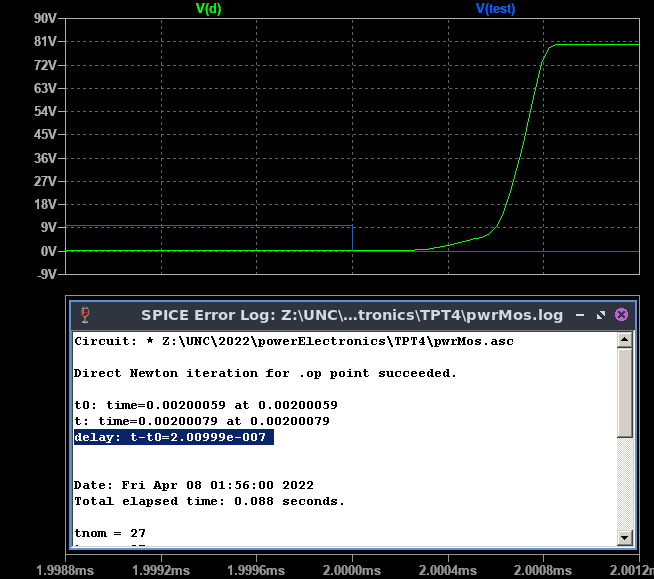

# **FCEFyN - UNC - ELECTRÓNICA INDUSTRIAL**
## DOCENTE: Prof. Esp. Ing. Adrián Claudio Agüero
## ALUMNO: Ferraris Domingo Jesus

---------------------------------------
---------------------------------------

# **Trabajo practico teorico 4:** 
## Mosfet de potencia.

-----------------------------------------

## **1. Mosfet elegido.** 

Se eligio el ***MOSFET de potencia IRF150*** que nos sirve junto con las simulaciones a tener un estudio mas detallado del dispositivo.
El mismo es un transistor MOSFET de enrriquecimiento con ***encapsulado TO-3*** para colocar en disipador y es fabricado con el proceso HEXFET de International Rectifier.

### **Caracteristicas.**

En la hoja de datos tenemos las siguientes caracteristicas principales:

* **IDM:** 38A como maximo a 25°C*** (baja a 24A a los 100°C) y una corriente de pulso maxima de 152A durante 10us.
* **VDSbr:** 100V como maxima VDS.
* **RDSon:** 55mOhm con corriente de drain de 24A, aumentando con la corriente a 65mOhm con ID maxima.
* **VTO:** En el rango de 2 a 4V. 
* **VGSM:** Como maximo de +/- 20V.
* **IGSS:** Una corriente de fuga entre gate y source de 100nA.
* **PD:** 150W con el encapsulado a 25°C.

### **Safe operating area.**

Se interpreta en la curva el limite de corriente alcanzable debido a RDSon y los valores maximos admisibles de ID y VDS, ***para no dañar el transistor se debe operar dentro del area demarcada inferior-izquierda (SOA).***
Vemos como en todo momento ***si VDS es alta se debe trabajar a menor corriente y viceversa para no dañar el dispositivo.***
Por ejemplo, si bien VDSbr e IDSM son 100V y 38A, para operar con una corriente de drain de 2A no hay que superar una VDS de 7V aprox. 
Ademas se muestran los resultados de pruebas por pulsos donde, por ejemplo se podria operar con una ***IDS arriba de 100A y manteniendo a VDS en 20V*** pero solo ***por menos de 10us.***

### **Capacidades del MOS.**

El fabricante tambien nos da el valor de las capacidades principales para distintos valores de VDS.

Con las ecuaciones dadas y para el origen (VDS de 1V), se observa que Cgd esta entorno a los 1.5nF, seguido por el Cds de 3.5nF y el mas grande Cgs del orden de 4nF y ***todos descienden a distinto ritmo con el aumento de VDS.***
Ademas vemos como si bien Cds es de mas del doble de Cgd, desciende rapidamente con el aumento de VDS a diferencia de Cgs que ademas de ser la capacidad paracita mas grande disminuye lentamente con VDS a un ritmo similar a Cgd.

--------------------------------------------------
## **2. Simulaciones.**

Utilizando ***LTSpice*** se simulo la conmutacion del ***transistor de potencia N-MOS IRF150*** y luego se compararon resultados con los del fabricante.

El setup usado para las simulaciones y mediciones fue el siguiente:

### **Tension, corriente y potencia.**

Al aplicar el pulso de prueba se aprecian los retardos en la tension y corriente de drain ***debidos a la carga y descarga de las capacidades parasitas.***

Tambien se ven los ***picos de disipacion*** en el momento de la conmutacion debidos a la existencia de ***altas corrientes y tensiones simultaneamente.***

Ademas es interesante notar los picos de disipacion durante micro segundos existente en la entrada durante la carga y descarga de las capacidades distribuidas.

### **Tiempos de conmutacion.**

El manual nos da las caracteristicas de conmutacion del transistor y las definiciones de cada una.

* ***Define td(on) para VGS*** como el tiempo en subir la tension ***desde el 10% al 90%*** de la amplitud del pulso de prueba usado. Y ***td(off)*** como el tiempo que demora VGS en bajar del ***90% al 10%*** del pulso aplicado.

* ***Define tr*** para VDS como el tiempo que demora en bajar del ***90% al 10% de la tension aplicada*** y ***tf*** como el tiempo en subir del ***10% al 90%*** de la tension aplicada.

Para el gate vemos como al aplicar el pulso de prueba azul se comienzan a cargar las capacidades distribuidas hasta llegar a la VTO donde empieza a aumentar la corriente IDS.
La tension sigue aumentando hasta que se carga Cgs donde se genera una meseta a los 6V aproximadamente, finalmente cuando el transistor supera la saturacion comienza a cargarse el capacitor Cgd lentamente hasta llegar a la tension maxima aplicada.

Calculando el intervalo definido por el fabricante nos da un ***td(on) = 1.28us muy superior a los 35ns del manual.***

Luego para el corte calculamos un ***td(off) = 1.08us*** tambien ***superior a los 170ns que nos da el fabricante.***

Por el lado de la tension en drain tenemos la siguiente forma de onda para la conduccion.

Que nos da un ***tr = 186ns*** aproximadamente, que esta ***dentro de los 190ns maximos del manual.***

Y para el corte del transistor.

Que nos da un ***tf = 201ns*** aproximadamente ***superior a los 130ns maximos del fabricante.***

Los valores son mas altos que los indicados por el manual, esto puede deberse a que el circuito de prueba suguerido para el practico no cumple con las condiciones de prueba del fabricante. Por ejemplo tiene una resistencia ***RG mucho mas grande que la usada por el fabricante de 2.35ohm***, lo que aumenta el tiempo de carga de las capacidades distribuiudas de entrada.

En efecto modificando el circuito para cumplir con las condiciones de prueba tenemos los siguientes resultados: 

Que estan dentro de las especificaciones maximas del fabricante, validando asi el modelo.

-------------------------------------
-------------------------------------

<!---
Insertar latex en pdf
--->

