# **FCEFyN - UNC - ELECTRÓNICA INDUSTRIAL**
## DOCENTE: Prof. Esp. Ing. Adrián Claudio Agüero
## ALUMNO: Ferraris Domingo Jesus

---------------------------------------
---------------------------------------

# **Trabajo practico teorico 5:** 
## Circuito de disparo para MOSFET.

------------------------------------------
## **Analisis del conversor.**

El sistema analizado es un ***conversor DC/DC elevador en topologia push-pull con aislacion a transformador***, que consta de las siguientes etapas:

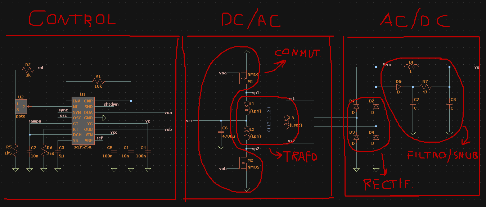

El ***bloque de control*** se encarga de generar señales de PWM con duty cycle (Dcy) variable para manejar los ***MOSFET de potencia*** que realizan la conmutacion en el bloque inversor DC/AC. Estos MOSFET fuerzan corriente e inducen la tension en el primario del ***transformador elevador*** que se vera aumentada en el bobinado secundario.

Finalmente en el bloque AC/DC tenemos un ***puente recificador monofasico de onda completa*** seguido de un ***filtro pasa bajos LC*** que se encarga de filtrar los armonicos proporcionando corriente continua a la carga. 

Tambien para disipar la energia de las oscilaciones en la conmutacion debidas a las inductancias y capacidades distribuidas del circuito, se agrega una ***red snubber para proteger los diodos*** de corrientes y sobretensiones.

Ademas se puede sensar la tension en la carga y realimentar este valor al bloque de control, por ejemplo por medio de un opto acoplador, para que varie el duty cycle elevando o disminuyendo la tension media sobre la carga segun la demanda de corriente.

--------------------------------------------------

## **Control del PWM.**

Para la generacion y control del PWM se usa el ***IC SG3525A:***

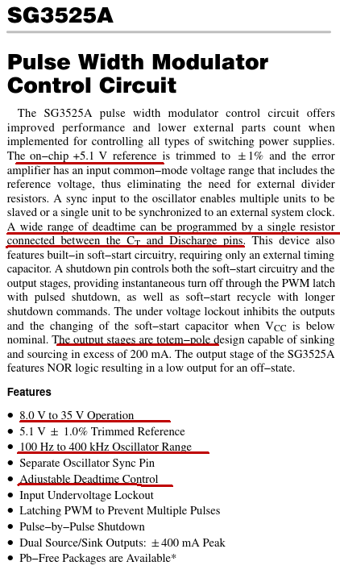

Que consta de salidas totem-pole, amplio rango de frecuencias, tiempo muerto entre conmutacion ajustable, un regulador para la tension de referencia y un ***duty cycle ajustable de 0 a 50%*** por medio de un amplificador de error integrado.

La configuracion va a ser la usada por el fabricante para las pruebas:

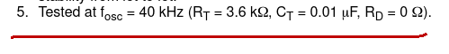

Donde el oscilador trabaja a 40KHz obteniendo en sus salidas un PWM de 20KHz aproximadamente.

No se utiliza la funcion shutdown ni arranque suave, se alimenta en integrado con los 24V y pone una tension Vgg para el gate de los MOS a determinar. 

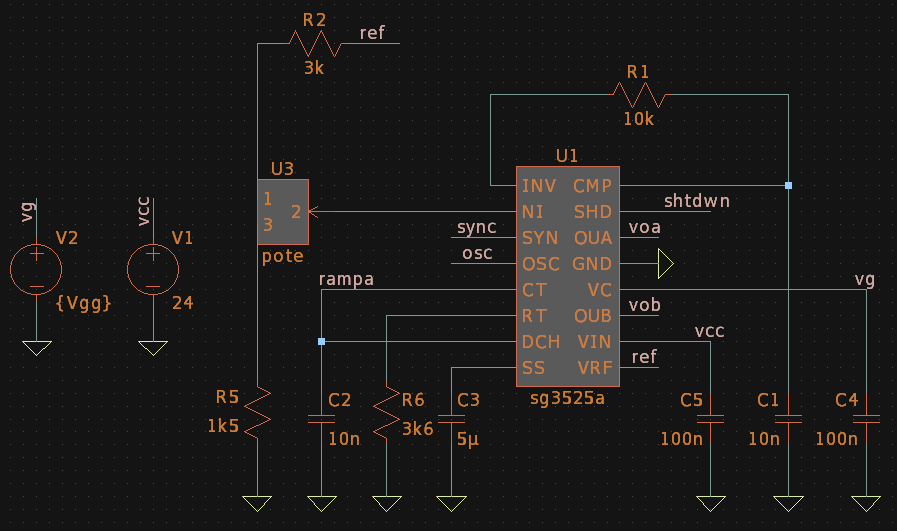

Vemos como si ponemos al 100% el potenciometro tenemos señales de PWM a 20KHz aproximadamente de duty cycle 50% y un tiempo muerto entre conmutaciones de 1us para esta configuracion:

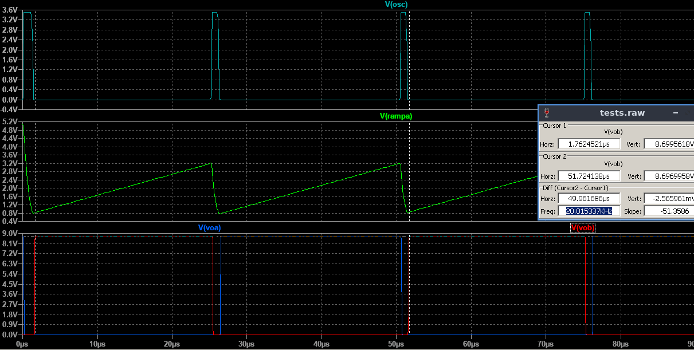

-------------------------------------------------------

## **Analisis de formas de onda.**

Ya con la etapa de control funcionando se trata de ***analizar las formas de onda (FO) mas importantes para entender el funcionamiento y poder seleccionar los componentes de potencia.***

### **Primario/Push-pull:**

Comenzamos analizando las FO de un bobinado primario en corte y conduccion.

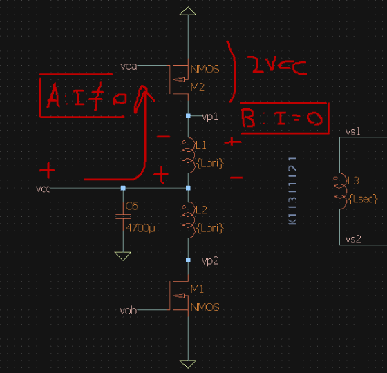

Al aplicar tension al gate ***(condicion A)*** de uno de los MOSFET, ***se aplica Vcc a uno de los devanados primarios*** siendo Vp1 negativa respecto a Vcc. En esta condicion ***Vds es muy baja.***

Al cortar la corriente ***(condicion B)*** el inductor por ley de faraday ***induce una tension de polaridad opuesta*** que genera un Vp1 positivo respecto a Vcc y ***Vds es del doble de la tension de alimentacion.***

Segun el analisis dibujamos las formas de onda tentativas:

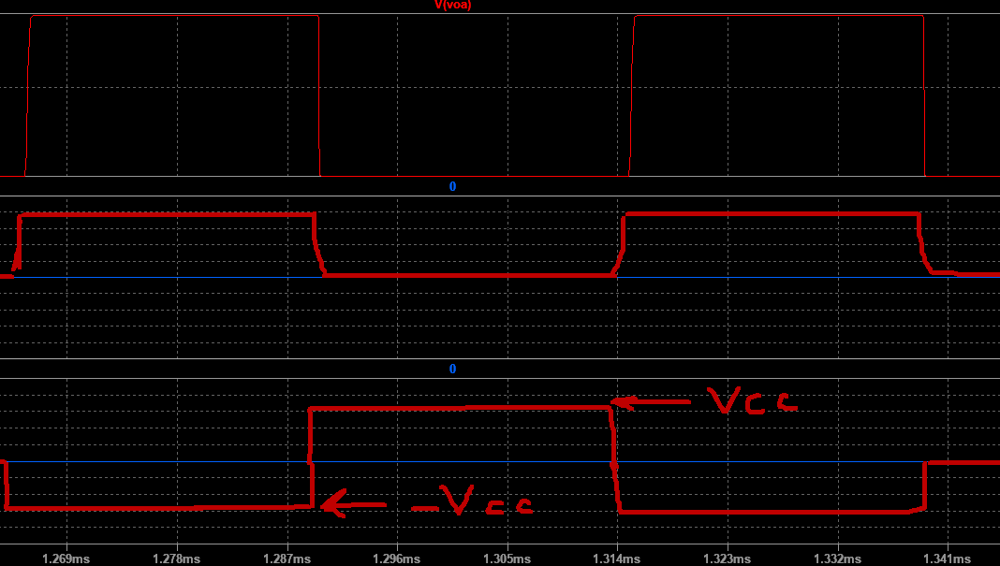

Y comparamos con las simuladas:

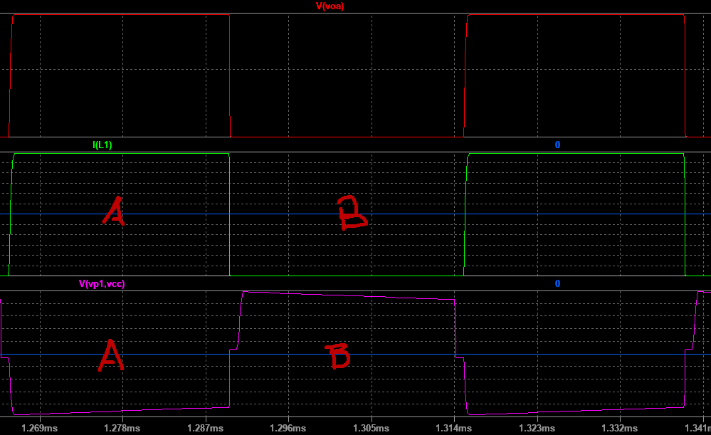

Lo mismo se repite alternadamente en el otro bobinado primario generando una tension igual pero en contra fase. Siendo la tension aplicada al primario la diferencia entre Vp1 y Vp2 se tiene en total una tension alterna cuadrada de 20KHz y valor pico 2Vcc.

Ademas en la simulacion se nota como ***el transistor de la rama que no conduce tiene una Vds de casi el doble de la tension de fuente.***

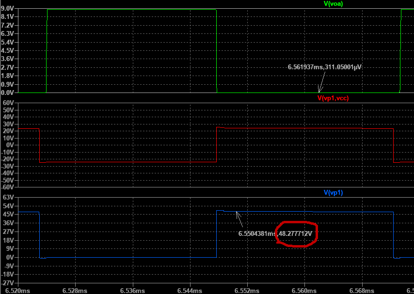

### **Secundario/rectificacion:**

Las tensiones de los bobinados primarios se suman y ***aparecen el el secundario afectadas por la relacion de transformacion (n).***

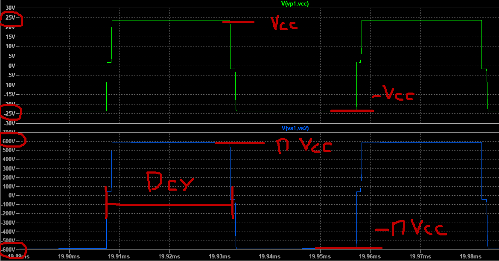

Luego la tension del secundario es rectificada por un puente rectificador monofasico de onda completa, lo que equivale a sacar el valor absoluto de la FO. Esto genera una tension ***continua pulsante del doble de frecuencia, cuyo valor medio depende del duty cycle (Dcy)*** y es el que se transmitira a la carga.

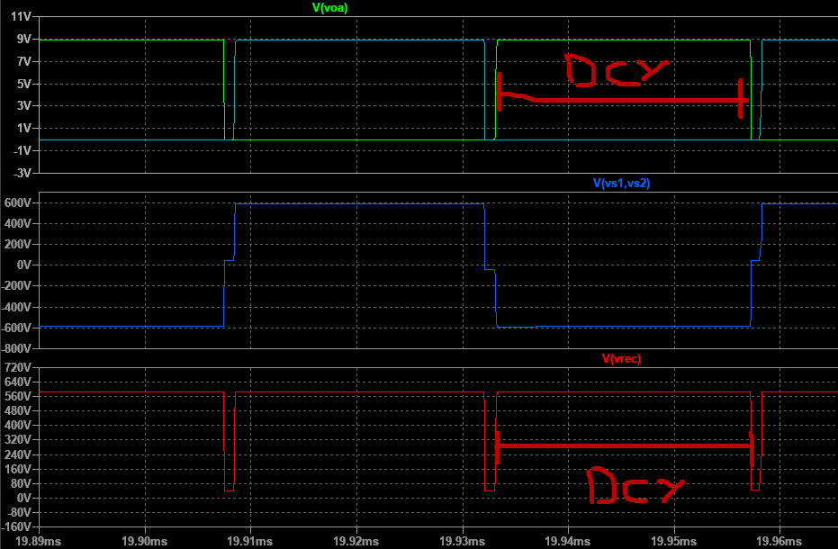

-----------------------------------------

***Para esta etapa surgieron muchos problemas en la simulacion del sistema al acoplar las etapas siguientes que complicaron muchisimo el analis de las FO:***

* En las conmutaciones se ***inducen ruidos en el PWM*** lo que deforma mucho la corrinente IDS, y por consiguiente la tension en el primario.
* La red snubber a la salida ***alarga mucho el tiempo de simulacion*** por razones desconocidas.
* Aun sin la red snubber, al acoplar las etapas existen muchas constantes de tiempo en juego lo que complejiza la simulacion y ***extiende en exceso el tiempo para llegar al estado estable*** de sistema (y empezar a analizar).

***Luego de dias probando distintos modelos, configuraciones, intentando desacoplar etapas por medio de buffers, aprendiendo sobre SPICE y tratando de optimizar la simulacion y mucha paciencia (sin exagerar, estuve dias) se realizaron los siguientes cambios:***

* El SG3525A no puede conectarse directamente al gate de los MOSFETS, por lo que ***se copia la tension de PWM con fuentes de tension controladas por tension*** y se conectan estas señales a los gates.
* ***Se desconecta la red snubber***, siendo un elemento de proteccion no deberia interferir en el funcionamiento del circuito.
* ***Se usan MOSFET ideales con Kp aumentado*** para que tengan mas capacidad de corriente, al menos hasta cerrar el diseño.

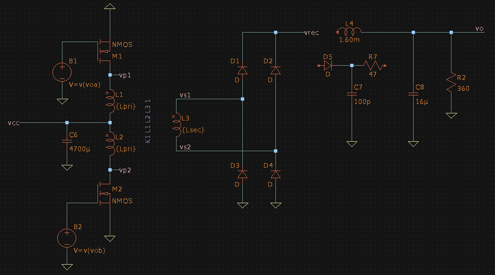

***Recien con estos cambios se pudo cerrar la simulacion completamente en tiempos razonables y continuar con el analisis (al menos con LTSpice y los modelos encontrados).***

----------------------------------------------------

### **Filtrado/Snubber:**

Continuando con el analisis, luego de la rectificacion se filtra la onda con un filtro LC donde por un lado la ***inductancia se encarga de mantener una corriente continua*** por la carga mientras que el ***capacitor estabiliza la tension*** en la carga.

Por ultimo la ***red Snubber*** tiene la funcion de disipar la energia en la conmutacion debida a las inductancias y capacidades distribuidas de los diodos y semiconductores. En la realidad al conmutar se generan oscilaciones amortiguadas de alta frecuencia que presentan picos de tension importantes y pueden dañar los semiconductores. Por ello la red se encarga de ***filtrar las altas frecuencias a masa por medio del capacitor y disipar la energia de las oscilaciones por medio de la resistencia.***

--------------------------------------

## **Seleccion de componentes/diseño.**

Seleccionamos los componentes teniendo en cuenta que ***se quiere llegar a la potencia nominal con un Dcy del 50% en el PWM del SG3525A*** (en la tension rectificada es del 100%).

> con las caracteristicas de la carga sabemos que:
$$
\begin{align*}
Vo&=600V \quad y \quad Po=1KW \newline 
&\rightarrow \mathbf{Io=\frac{Po}{Vo}=1.67A} \newline
&\rightarrow \mathbf{RL=\frac{Vo}{Io}=360\Omega}
\end{align*}
$$

### **MOSFET de potencia:**

Por medio de un barrido parametrico de Vgg, se determina que para llegar a la tension de trabajo del secundario con carga se ***necesita una Vgg de 10V*** y tiene que circular una ***corriente media de 19.8A y en el inicio una no repetitiva de 236A aproximadamente por MOSFET.***

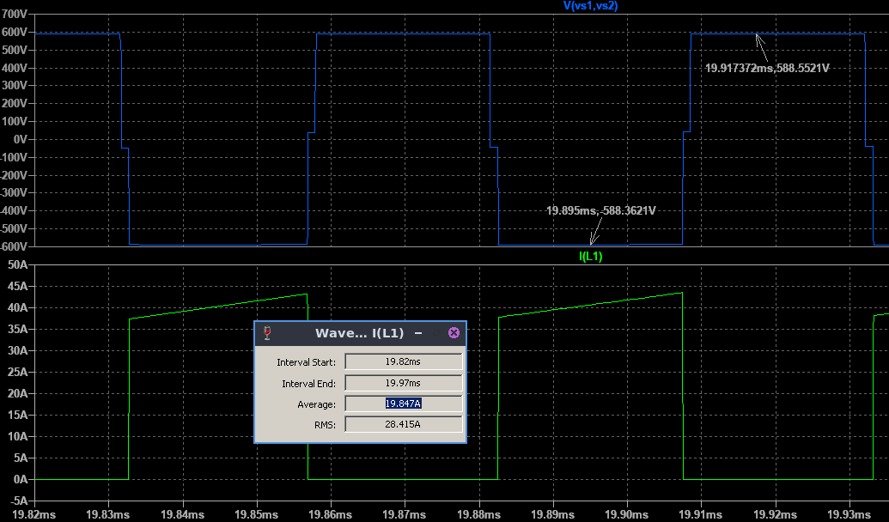

Y como analizamos anteriormente la ***maxima tension Vds (Vdsp) que tienen que aguantar es de 48V (50V aprox.).***

> aplicamos los coeficientes de seguridad:
$$
\begin{align*}
IDav&=19.8A \quad y \quad Vdsp=50V \newline 
&\rightarrow \mathbf{IDRM\geq IDav+30Porc =25.74A} \newline
&\rightarrow \mathbf{IDSM\geq 236A}\newline
&\rightarrow \mathbf{VDSbr\geq 2.5\cdot Vdsp=125V}\newline
\end{align*}
$$

Para minimizar las perdidas buscamos un MOSFET con la ***menor Ron y Qgs posible*** pero que cumpla con los niveles de tension y corriente.

Rapidamente en ***LTSpice*** podemos elegir el ***MOSFET de potencia IPB065N15N3*** de Infineon:

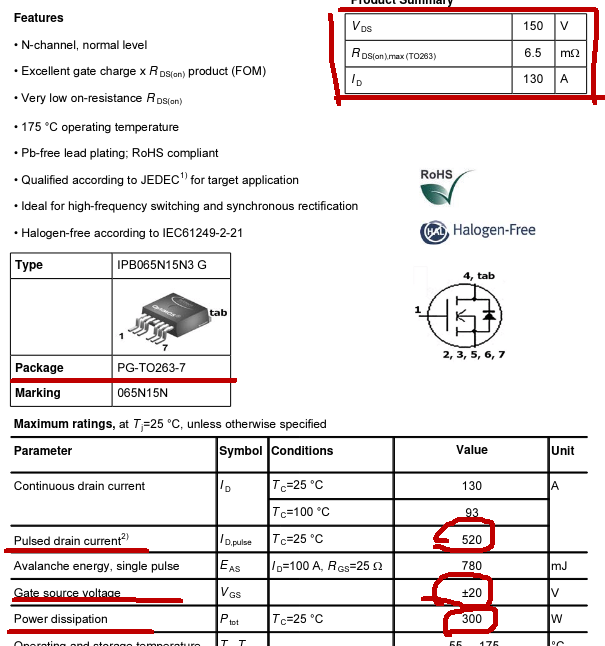

Que tiene encapsulado TO263, tension y corrientes maximas de ***150V y 130A*** (520A no repetitiva a 25°C), y potencia maxima de ***300W***. Ademas se indica una Ron maxima de ***6.5mOhm*** y una Qgs ***alrededor de 30nC.*** 

### **Diodos rectificadores/transformador:**
Para los diodos estudiamos el valor medio de la tension rectificada en funcion del Dcy y la tension maxima del secundario (Vsp).

> considerandola cuadrada y teniendo en cuenta que tiene el doble de frecuencia que la del secundario:

$$
\begin{align*}
Vo=\frac{1}{Trect} \int _{Trect\cdot Dcy}^{ } vrect(t)\ dt
= \frac{2}{T} \int _{\frac{T}{2}\cdot Dcy}^{ } Vsp\ dt = Dcy\cdot Vsp
\end{align*}
$$

> si se quiere llegar a la potencia nominal con un Dcy del 100% en la salida (en el PWM es de 50%):

$$
\begin{align*}
Vo=Dcy\cdot Vsp=1\cdot Vsp=600V
\end{align*}
$$

> entonces sacamos la relacion de transformacion del transformador elevador:

$$
\begin{align*}
n=\frac{Vsp}{Vpp}=\frac{600V}{24V}=25
\end{align*}
$$

> que modelamos en LTSpice como inductores acoplados con la siguiente relacion:
$$
\begin{align*}
n^2&=\frac{L2}{L1}\newline
&\rightarrow \mathbf{L1=100uH} \newline
&\rightarrow \mathbf{L2=63mH}
\end{align*}
$$

*Sin embargo se agregaron resistencias a todos los inductores para ayudar a cerrar las simulaciones, estas produciran perdidas por lo que seguramente deberemos ajustar la relacion de transformacion mas adelante.*

> ademas analizando el circuito con los diodos en inversa, tenemos como tension pico inversa:

$$
\begin{align*}
Vrp=Vsp=600V
\end{align*}
$$

> y como las ramas en paralelo son 2:

$$
\begin{align*}
IFav=\frac{Io}{2}=0.835A
\end{align*}
$$

> aplicamos los coeficientes de seguridad:
$$
\begin{align*}
IFav&=0.835A \quad y \quad Vrp=600V \newline 
&\rightarrow \mathbf{IFRM\geq IFav + 30Porc = 1.1A} \newline
&\rightarrow \mathbf{VRRM\geq Vrp \cdot 2.5 = 1667V}\newline
\end{align*}
$$

Con el buscador de Mouser seleccionamos el ***diodo Schottky GD05MPS17H*** de GeneSic: 

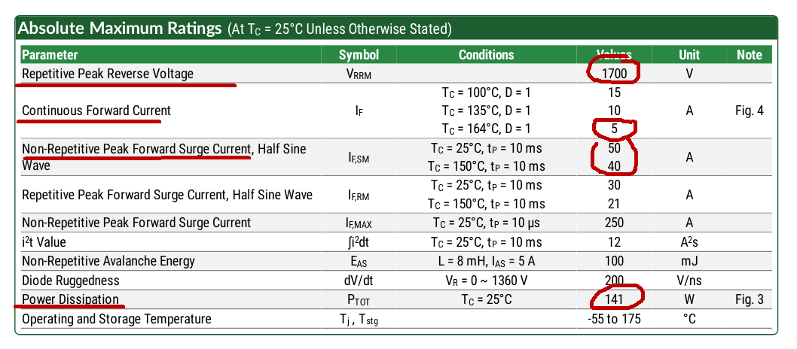

En encapsulado TO-247, soporta ***1.7KV en inversa***, una corriente de ***5A en su condicion de temperatura mas desfavorable*** y una potencia de ***141W.*** 

### **Filtro LC:**
Para el filtro de salida usamos Laplace para estudiar su comportamiento en frecuencia:

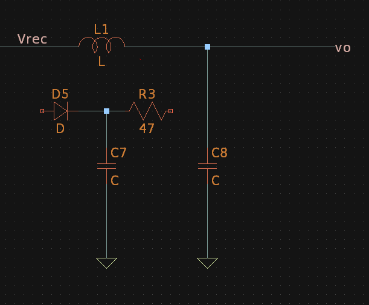

> funcion de tranferencia:

$$
\begin{align*}
Vo&=Vrec\cdot \frac{XC}{XC+XL}
=Vrec\cdot \frac{1}{1+\frac{XL}{XC}} \newline
G&=\frac{1}{1+\frac{XL}{XC}}
=\frac{1}{1+sL\cdot sC}
=\frac{1}{1+LCs^2} \equiv \frac{1}{1+(\frac{s}{\omega p})^2} \newline
&\rightarrow  \omega p=\frac{1}{\sqrt{LC}}
\end{align*}
$$

Donde tiene un pico de resonancia en wp y luego decae a 40dB/dec.

> si proponemos que L sea 100 veces C y calculamos para una frecuencia de 1KHz:
$$
\begin{align*}
\omega p&=\frac{1}{\sqrt{LC}}
=\frac{1}{C\sqrt{100}} \newline
&\rightarrow \mathbf{C=\frac{1}{2\pi\cdot 1kHz\cdot 10}=16uF} \newline
&\rightarrow \mathbf{L=100C=1.6mH}
\end{align*}
$$

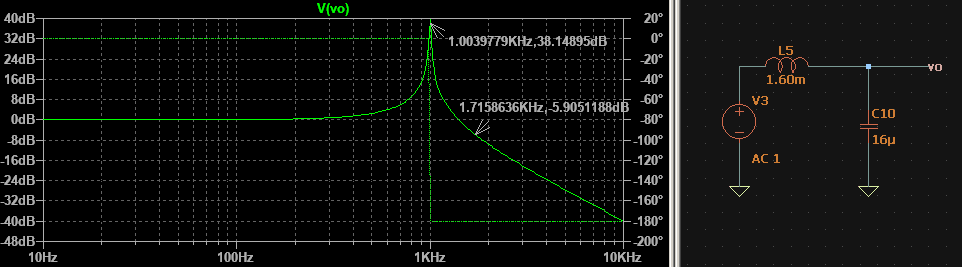

Con lo que las frecuencias superiores a 1kHz seran atenuadas considerablemente.

### **Red snubber:**

Por ultimo la red Snubber tiene la funcion de disipar la energia en la conmutacion debida a ***oscilaciones de alta frecuencia***, por lo que se eligio un capacitor chico de 100pF.

------------------------------------------------------

## Simulaciones finales.

Cerrado el diseño y seleccionados los componentes primeramente se ***simulo con modelos ideales el circuito sin la red snubber*** para estudiar la tension corriente y potencia sobre la carga.

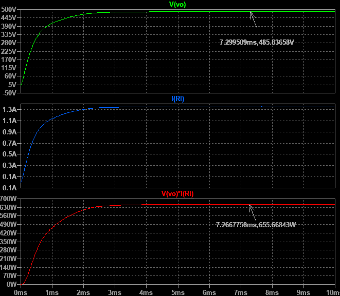

Esta es un poco baja debido a diversas perdidas por lo que ***se ajusto la relacion de transformacion*** para alcanzar los 600V de salida. Por medio de un barrido parametrico se ajusto L2 a 140mH y se obtuvo:

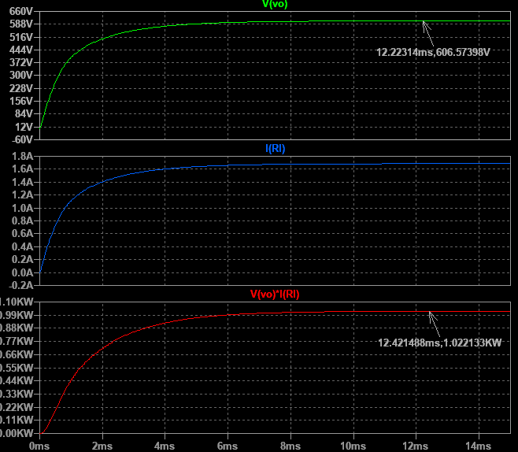

Valores mucho mas cercanos a las especificaciones.

Ademas se simulo para Dcy de 10, 25, 40 y 50% la tension y potencia sobre la carga para visualizar la variacion en funcion del Dcy:

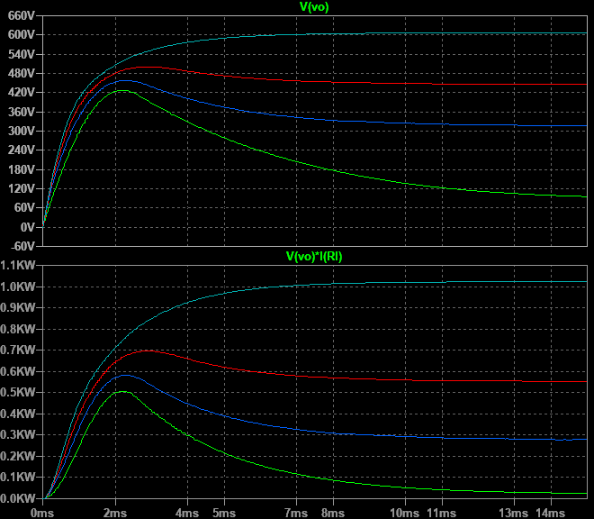

Por ultimo se ***conecto la red Snubber y se reemplazaron los modelos ideales por los del fabricante*** con practicamente los mismos resultados:

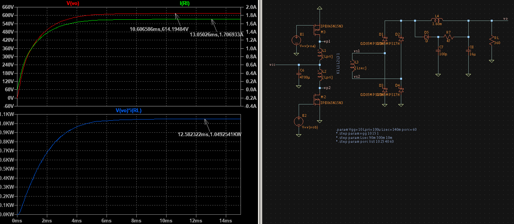

-------------------------------------
-------------------------------------

<!---
Insertar latex en pdf
--->

