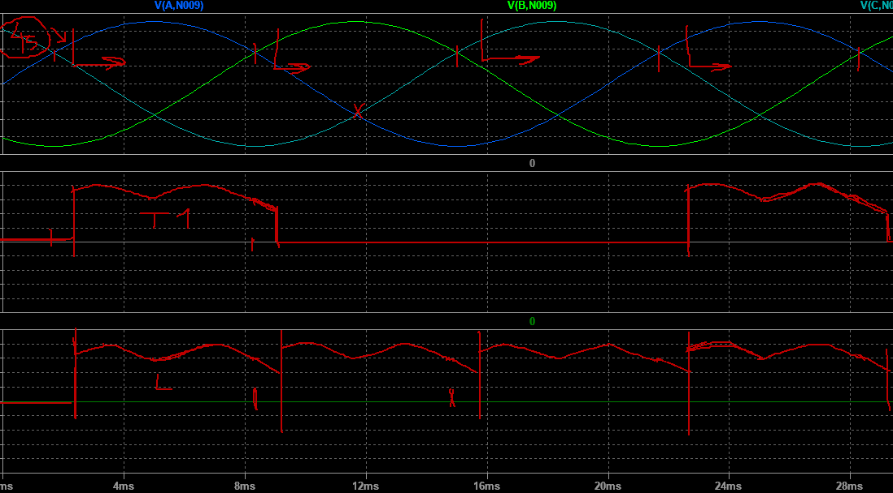
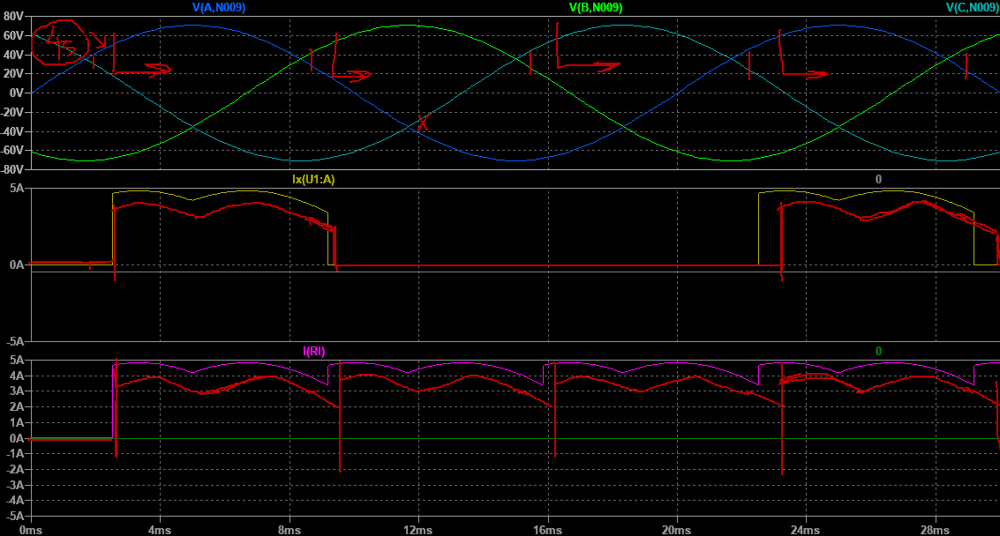
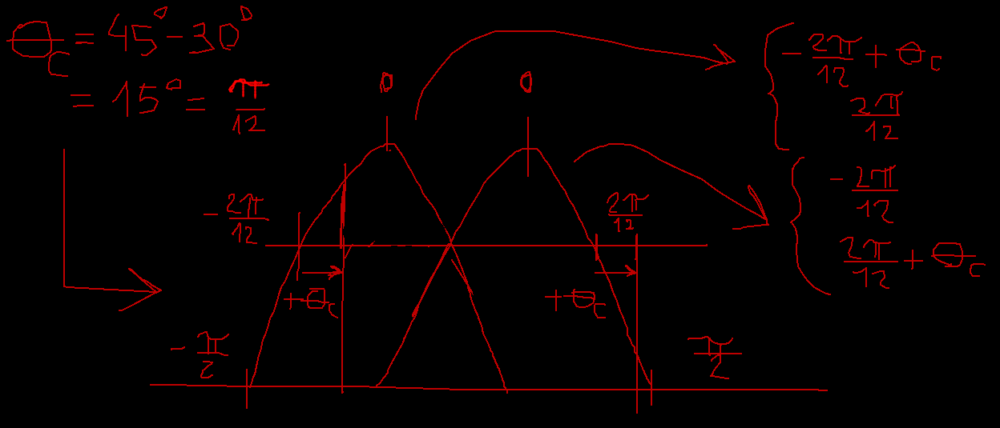
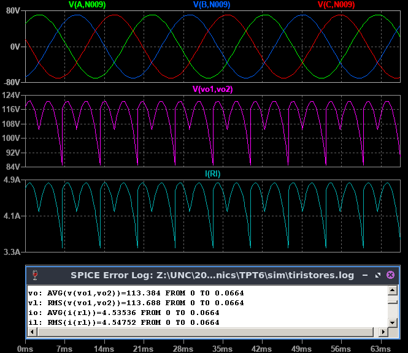
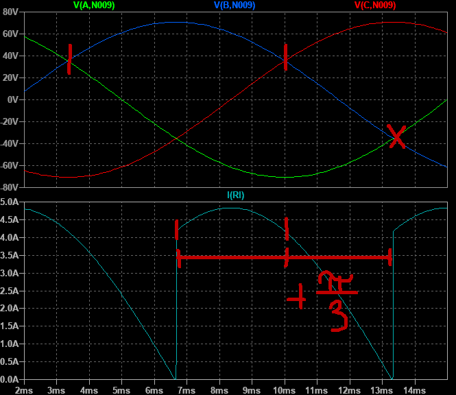
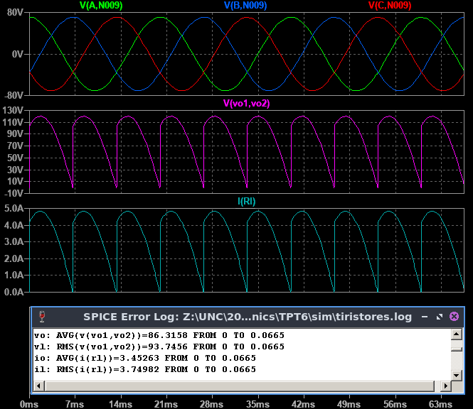
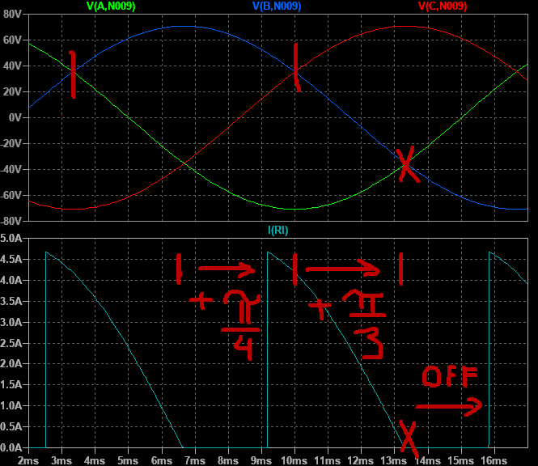
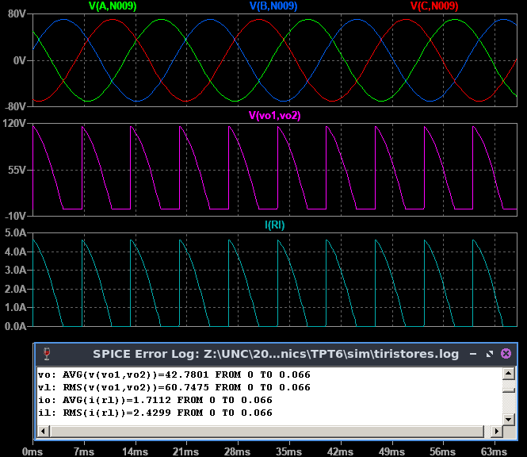

# **FCEFyN - UNC - ELECTRÓNICA INDUSTRIAL**
## DOCENTE: Prof. Esp. Ing. Adrián Claudio Agüero
## ALUMNO: Ferraris Domingo Jesus

---------------------------------------
---------------------------------------

# **Trabajo practico teorico 6:** 
## Tiristores.

-----------------------------------------

## **1. Tiristor elegido.** 

Se eligio el ***Tiristor de potencia VS-50RIA-100*** en version Stud, de Vishay Semiconductors.

### **Caracteristicas:**

En la hoja de datos tenemos las siguientes caracteristicas principales:

* **ITav:** 50A como maximo con encapsulado a 94°C y aplicando el semi-periodo de una senoidal.
* **VTrms:** 80A como maximo.
* **ITSM:** Nos da los valores para un pulso senoidal de 10ms/8.3ms de 1430 / 1490A si despues del pulso no se reaplica tension, y 1200 / 1255A si luego del pulso se reaplica la tension VRRM. 
* **VDRM/VRRM:** Para este dispositivo de la serie es de 1kV, para directa o inversa. 
* **VRSM:** No repetitiva de 1.1kV para pulsos menores o iguales a 5ms.
* **i2t:** Nos da los valores para un pulso senoidal de 10ms/8.3ms de 10.18 / 9.30kA2s si despues del pulso no se reaplica tension, y 7.20 / 6.56kA2s si luego del pulso se reaplica la tension VRRM. 

---------------------------------------

### **Parametros de compuerta:**

El fabricante nos da las ***caracteristicas maximas de compuerta*** de tension aplicada maxima ***(VGM) de +20 / -10V***, corriente maxima ***(IGM) de 2.5A***, potencia media ***(PGav) de 2.5W*** y potencia maxima pico ***(PGM) de 10W durante 5ms o menos.***

Tambien nos da los valores de disparo:

* Dispara con ***100mA y 2.5V o mas en compuerta*** (IGT/VGT)
* No dispara con ***5mA y 0.2V o menos en compuerta*** (IGD/VGD).

Con estos datos podemos graficar la ***caracteristica de compuerta aproximada*** (no esta a escala) e identificar la ***zona de disparo incierta (ZDI)*** y el ***punto pivote*** para la seleccion de la resistencia de disparo:

Ademas el fabricante nos da en este caso la caracteristica de compuerta para toda la serie VS50-RIA:

-----------------------------------------------

### **Potencia vs corriente media:**

El fabricante tambien nos da la curva de ***potencia media en funcion de la corriente media*** para una senoidal con distintos angulos de conduccion.

Por ejemplo para una corriente media de 25A y un angulo de conduccion de 180° (medio ciclo senoidal) el tiristor puede disipar hasta 30W como maximo.

Tambien en los extremos de cada curva nos indican el limite maximo de corriente RMS. Notamos como ***para angulos de conduccion menores la corriente RMS decrece***, esto es porque esta se hace mas impulsiva pudiendo superar la temperatura maxima de juntura.

-------------------------------------------------
### **Montaje en aplicacion de potencia:**

Para un ***puente rectificador monofasico de onda completa semi-controlado con carga resistiva***, el esquema seria el siguiente:

Para el armado se usa un par de ***tiristores de potencia tipo catodo a Stub***, un par de ***diodos de potencia tipo anodo a Stub***, y 2 disipadores para cada par de elementos.

Se toma uno de los disipadores y se roscan los catodos de los tiristores, los anodos por separado se conectan a las fases del transformador, el disipador se conecta a la carga y los gates por separado a los terminales del circuito de disparo.

Luego se toma el otro disipador y se roscan los 2 diodos de potencia, se conectan sus catodos a las fases del transformador y como el disipador es el anodo se conecta a la carga directamente.

Siempre se debe tener cuidado de ***no pasar del torque maximo dado por el fabricante*** para cada diodo y tiristor.

--------------------------------------------------
-------------------------------------------------

## **2. Simulaciones.**

Se analiza y simula un ***circuito rectificador trifasico de onda completa con carga resistiva***. Ademas se calculan y simulan los ***valores medios y eficaces en la carga.***

Para el caso de un ***angulo de disparo de 45° medidos desde el tiempo 0***, con las fases intentamos dibujar las FO de corriente por un tiristor y la carga.

Utilizamos los siguientes pasos:

* Dibujar las FO para el caso no controlado.
* Acotar el inicio segun el punto de disparo.
* Acotar el final cuando empiece a conducir la otra fase.
* Tener en cuenta que el tiristor de la fase A siempre se apagara cuando VA=VC, el de la fase B cuando VB=VA y el de la fase C cuando VC=VB.

Siguiendo el metodo dibujamos las FO tentativas para el tiristor de la fase A y la carga:

Y comparamos con las simuladas:

Salvando alguna asimetria por dibujar a mano, la forma de onda se respeta entonces consideramos valido el metodo de dibujo.

> sacamos caracteristicas importantes de la corriente y tension en la carga:

Para la corriente tenemos:
* Periodo 2pi/3.
* Corriente pico de linea.

Para la tension:
* Periodo 2pi/3.
* Tension pico de linea.

Como tenemos que calcular los valores medios y eficaces, debemos integrar las FO.

Para la integracion optamos por definir:

* **Angulo de ignicion:** Intevalo entre que el tiristor ya esta listo para conducir (polarizado) y el momento en que empieza a hacerlo (punto de disparo).

* **Angulo de conduccion:** Intervalo durante el cual el tiristor conduce corriente.

* **Angulo de exticion:** Intervalo entre que el tiristor esta listo para conducir hasta donde termina de hacerlo.

Para sacar los limites de integracion, si tenemos en cuenta el caso no controlado teniamos que integrar 2 pulsos senoidales de corriente en intervalos simetricos. ***Ahora es necesario analizar el aporte de cada pulso de corriente.***

Por ello dibujamos ***2 pulsos cosenoidales simetricos entre +/-2pi/12 con valor cero fuera de los pulsos.***
Y notamos que ***al quitar area al primer pulso se la sumamos al segundo.***

Considerando el ***punto de conduccion a los 45° (absolutos)***, y que a los 30° el tiristor de la fase A esta polarizado, tenemos un ***angulo de ignicion de 45°-30° = 15°***, y el esquema nos queda:

**(NOTA: Hay un error, tita sub c es en realidad el angulo de ignicion tita sub i).**

> obtenemos los intevalos de integracion:

Primer pulso:
* Coseno centrado en cero.
* Desde -2pi/12+pi/12 a 2pi/12.

Segundo pulso:
* Coseno centrado en cero.
* Desde 2pi/12 a 2pi/12+pi/12.

> para este caso nos interesan las integrales:

$$
\begin{align*}
A&=\int _{-\frac{2\pi }{12}+\frac{\pi }{12}}^{\frac{2\pi}{12}} cos(\theta)d\theta +\int _{-\frac{2\pi}{12}}^{\frac{2\pi}{12}+\frac{\pi}{12}} cos(\theta)d\theta \newline
B&=\int _{-\frac{2\pi}{12}+\frac{\pi}{12}} ^{\frac{2\pi}{12}}cos^2(\theta)d\theta + \int _{-\frac{2\pi}{12}} ^{\frac{2\pi}{12}+\frac{\pi}{12}} cos^2(\theta)d\theta
\end{align*}
$$

Que calculamos y luego reemplazamos segun aparezcan.

> para la tension y corriente media:

$$
\begin{align*}
Vo&=\frac{1}{T}\int _{T} Vlin_p\cdot cos(\theta)d\theta
=\frac{3}{2\pi }Vlin_p\cdot \left(\int _{-\frac{2\pi }{12}+\frac{\pi }{12}}^{\frac{2\pi}{12}} cos(\theta)d\theta +\int _{-\frac{2\pi}{12}}^{\frac{2\pi}{12}+\frac{\pi}{12}} cos(\theta)d\theta \right) \newline
&=\frac{3}{2\pi}Vlin_p\cdot A
=\frac{3}{2\pi}\sqrt{6}\cdot Vs\cdot A
=\frac{3}{2\pi}\sqrt{6}\cdot 50V\cdot A
=114.96V\newline\newline
Io&=\frac{1}{T}\int _{T} Is_p\cdot cos(\theta)d\theta
=\frac{3}{2\pi} Is_p\cdot A
=\frac{3}{2\pi} 4.38A\cdot A
=4.53A
\end{align*}
$$

> para la tension y corriente eficaz:

$$
\begin{align*}
VL^2&=\frac{1}{T}\int _{T} (Vlin_p\cdot cos(\theta))^2 d\theta
=\frac{3}{2\pi}Vlin_p^2\cdot \left(\int _{-\frac{2\pi}{12}+\frac{\pi}{12}}^{\frac{2\pi}{12}}(cos(\theta))^2d\theta + \int _{-\frac{2\pi}{12}}^{\frac{2\pi}{12}+\frac{\pi}{12}}(cos(\theta))^2d\theta\right)\newline
&=\frac{3}{2\pi}Vlin_p^2\cdot B\newline
\rightarrow VL&=Vlin_p\cdot \sqrt{\frac{3}{2\pi}\cdot B}
=Vs\sqrt{6}\cdot \sqrt{\frac{3}{2\pi}\cdot B}
=50V\sqrt{6}\cdot \sqrt{\frac{3}{2\pi}\cdot B}
=115.27V\newline\newline
IL^2&=\frac{1}{T}\int _{T} (Is_p\cdot cos(\theta))^2 d\theta
=\frac{3}{2\pi}Is_p^2\cdot B\newline
\rightarrow IL&=Is_p\cdot \sqrt{\frac{3}{2\pi}\cdot B}
=4.83A\cdot \sqrt{\frac{3}{2\pi}\cdot B}
=4.54A
\end{align*}
$$

> en resumen, sobre la carga:
$$
\begin{align*}
\mathbf{Vo=114.96V\quad Io=4.53A}\newline
\mathbf{VL=115.27V\quad IL=4.54A}
\end{align*}
$$

Que podemos comparar con las simulaciones:

Se ven valores de tension un poco menores en la simulacion, pero esto se debe a que ***para el calculo por simplicidad no se tienen en cuenta las caidas de tension en diodos y tiristores*** por las cuales en realidad cae un poco menos de la tension de linea en la carga.

Siguiendo el mismo procedimiento descripto se calcularon y compararon con la simulacion los valores en la carga para los puntos de conduccion (absolutos) de 90° y 135°.

Para el punto de conduccion en 90° tenemos un ***angulo de ignicion de 90°-30° = 60° = pi/3***. En este caso el primer impulso de corriente desaparece de la FO y el segundo llega hasta ***casi el limite de apagado del tiristor.***

> analizamos los aportes de cada pulso:

Primer pulso:
* El primer pulso no aporta area.

Segundo pulso:
* Coseno centrado en cero.
* Desde -2pi/12 a 2pi/12+pi/3

> nos interesan las integrales:

$$
\begin{align*}
A&=\int _{-\frac{2\pi}{12}} ^{\frac{2\pi}{12}+\frac{\pi}{3}} cos(\theta)d\theta \newline
B&=\int _{-\frac{2\pi}{12}} ^{\frac{2\pi}{12}+\frac{\pi}{3}} cos^2(\theta)d\theta
\end{align*}
$$

> para la tension y corriente media:

$$
\begin{align*}
Vo&=\frac{1}{T}\int _{T} Vlin_p\cdot cos(\theta)d\theta
=\frac{3}{2\pi }Vlin_p\cdot A \newline
&=\frac{3}{2\pi}\sqrt{6}\cdot Vs\cdot A
=\frac{3}{2\pi}\sqrt{6}\cdot 50V\cdot A
=87.71V\newline\newline
Io&=\frac{1}{T}\int _{T} Is_p\cdot cos(\theta)d\theta
=\frac{3}{2\pi} Is_p\cdot A
=\frac{3}{2\pi} 4.83A\cdot A
=3.46A
\end{align*}
$$

> para la tension y corriente eficaz:

$$
\begin{align*}
VL^2&=\frac{1}{T}\int _{T} (Vlin_p\cdot cos(\theta))^2 d\theta
=\frac{3}{2\pi}Vlin_p^2\cdot B\newline
\rightarrow VL&=Vs\sqrt{6}\cdot \sqrt{\frac{3}{2\pi}\cdot B}
=50V\sqrt{6}\cdot \sqrt{\frac{3}{2\pi}\cdot B}
=95.13V\newline\newline
IL^2&=\frac{1}{T}\int _{T} (Is_p\cdot cos(\theta))^2 d\theta
=\frac{3}{2\pi}Is_p^2\cdot B\newline
\rightarrow IL&=Is_p\cdot \sqrt{\frac{3}{2\pi}\cdot B}
=4.83A\cdot \sqrt{\frac{3}{2\pi}\cdot B}
=3.75A
\end{align*}
$$

> en resumen, sobre la carga:
$$
\begin{align*}
\mathbf{Vo=87.71V\quad Io=3.46A}\newline
\mathbf{VL=95.13V\quad IL=3.75A}
\end{align*}
$$

Nuevamente comparando con las simulaciones:

Con algunas variaciones para las tensiones pero siguen estando dentro del rango.

Para el punto de conduccion en 135° el ***angulo de ignicion es de 135°-30° = 105°***. El primer pulso de corriente desaparece de la FO y ***se recorta ademas el segundo pulso en 105°-60° = 45° =pi/4*** y el ***tiristor esta apagado al final por un tiempo.***

> analizamos los aportes de los pulsos:

Primer pulso:
* El primer pulso no aporta area.

Segundo pulso: 
* Coseno centrado en cero.
* Desde -2pi/12+pi/4 a 2pi/12+pi/3.

> nos interesan las integrales:

$$
\begin{align*}
A&=\int _{-\frac{2\pi}{12}+\frac{\pi}{4}} ^{\frac{2\pi}{12}+\frac{\pi}{3}} cos(\theta)d\theta \newline
B&=\int _{-\frac{2\pi}{12}+\frac{\pi}{4}} ^{\frac{2\pi}{12}+\frac{\pi}{3}} cos^2(\theta)d\theta
\end{align*}
$$

> para la tension y corriente media:

$$
\begin{align*}
Vo&=\frac{1}{T}\int _{T} Vlin_p\cdot cos(\theta)d\theta
=\frac{3}{2\pi }Vlin_p\cdot A \newline
&=\frac{3}{2\pi}\sqrt{6}\cdot Vs\cdot A
=\frac{3}{2\pi}\sqrt{6}\cdot 50V\cdot A
=43.34V\newline\newline
Io&=\frac{1}{T}\int _{T} Is_p\cdot cos(\theta)d\theta
=\frac{3}{2\pi} Is_p\cdot A
=\frac{3}{2\pi} 4.83A\cdot A
=1.71A
\end{align*}
$$

> para la tension y corriente eficaz:

$$
\begin{align*}
VL^2&=\frac{1}{T}\int _{T} (Vlin_p\cdot cos(\theta))^2 d\theta
=\frac{3}{2\pi}Vlin_p^2\cdot B\newline
\rightarrow VL&=Vs\sqrt{6}\cdot \sqrt{\frac{3}{2\pi}\cdot B}
=50V\sqrt{6}\cdot \sqrt{\frac{3}{2\pi}\cdot B}
=61.58V\newline\newline
IL^2&=\frac{1}{T}\int _{T} (Is_p\cdot cos(\theta))^2 d\theta
=\frac{3}{2\pi}Is_p^2\cdot B\newline
\rightarrow IL&=Is_p\cdot \sqrt{\frac{3}{2\pi}\cdot B}
=4.83A\cdot \sqrt{\frac{3}{2\pi}\cdot B}
=2.43A
\end{align*}
$$

> en resumen, sobre la carga:
$$
\begin{align*}
\mathbf{Vo=43.34V\quad Io=1.71A}\newline
\mathbf{VL=61.58V\quad IL=2.43A}
\end{align*}
$$

Y comparando con las simulaciones:

Vemos ***como segun el angulo de ignicion*** se pueden cortar las FO de corriente y tension sobre la carga para ***variar los valores medios y eficaces de tension y corriente.***

-------------------------------------
-------------------------------------

<!---
Insertar latex en pdf
--->

