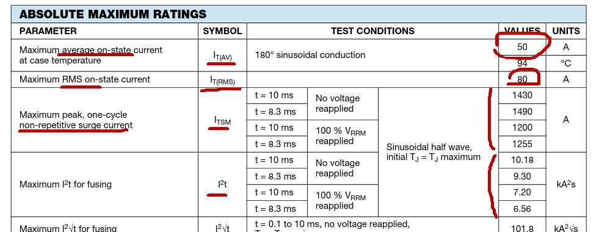
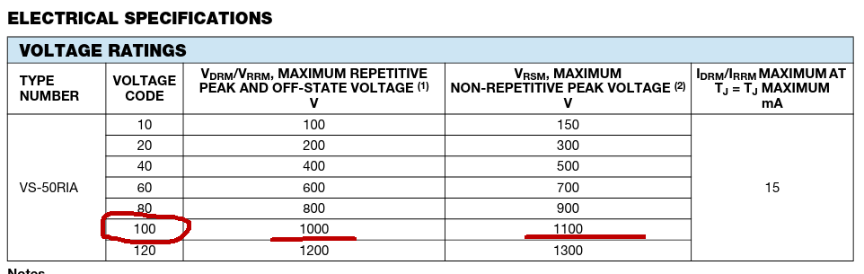
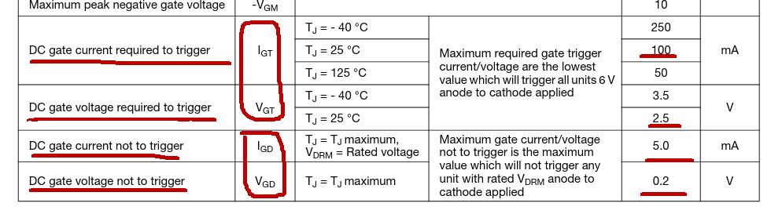
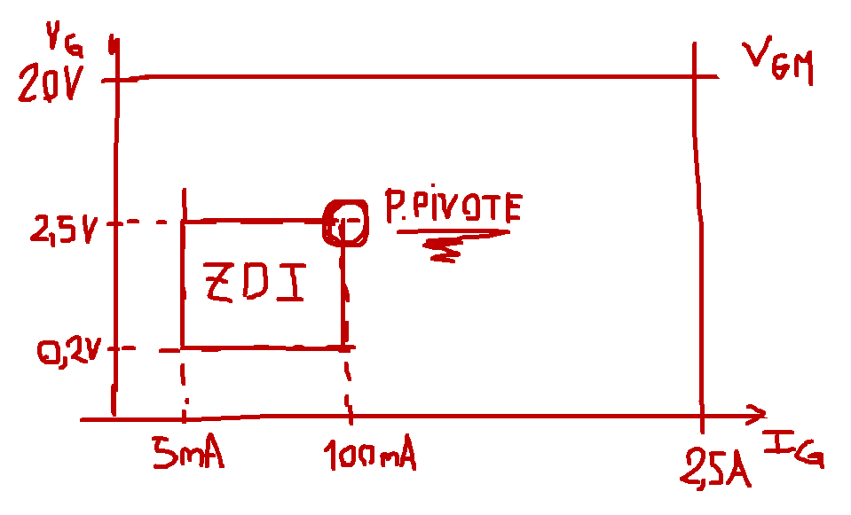
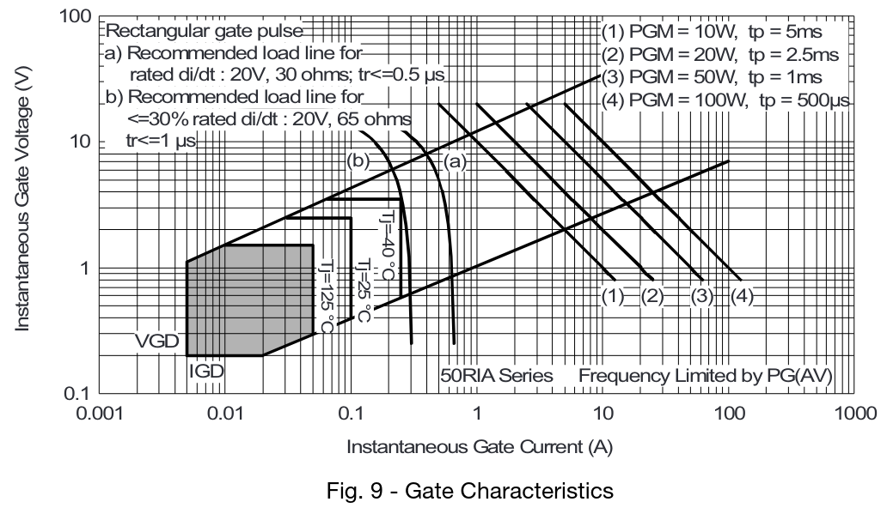
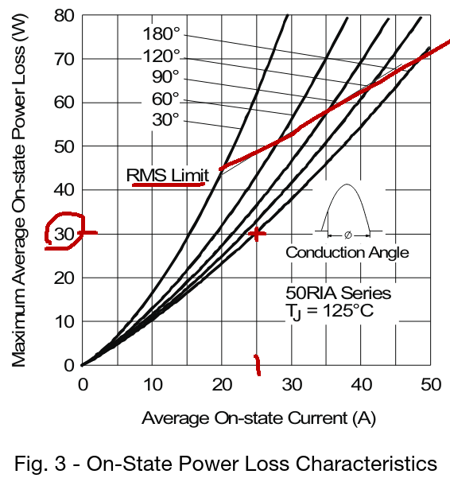
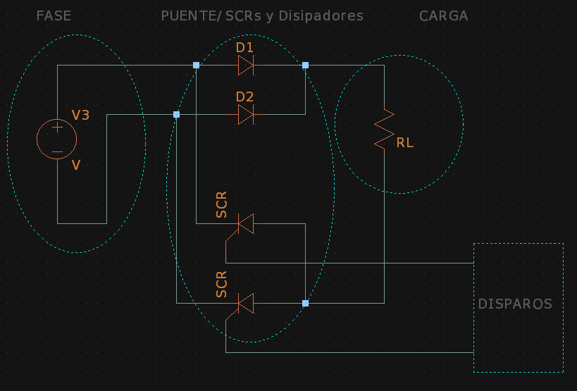

# **FCEFyN - UNC - ELECTRÓNICA INDUSTRIAL**
## DOCENTE: Prof. Esp. Ing. Adrián Claudio Agüero
## ALUMNO: Ferraris Domingo Jesus

---------------------------------------
---------------------------------------

# **Trabajo practico teorico 4:** 
## Mosfet de potencia.

-----------------------------------------

## **1. Tiristor elegido.** 

Se eligio el ***Tiristor de potencia VS-50RIA-100*** en version Stud, de Vishay Semiconductors.

### **Caracteristicas:**

En la hoja de datos tenemos las siguientes caracteristicas principales:

* **ITav:** 50A como maximo con encapsulado a 94°C y aplicando el semi-periodo de una senoidal.
* **VTrms:** 80A como maximo.
* **ITSM:** Nos da los valores para un pulso senoidal de 10ms/8.3ms de 1430 / 1490A si despues del pulso no se reaplica tension, y 1200 / 1255A si luego del pulso se reaplica la tension VRRM. 
* **VDRM/VRRM:** Para este dispositivo de la serie es de 1kV, para directa o inversa. 
* **VRSM:** No repetitiva de 1.1kV para pulsos menores o iguales a 5ms.
* **i2t:** Nos da los valores para un pulso senoidal de 10ms/8.3ms de 10.18 / 9.30kA2s si despues del pulso no se reaplica tension, y 7.20 / 6.56kA2s si luego del pulso se reaplica la tension VRRM. 

### **Parametros de compuerta:**

El fabricante nos da las caracteristicas maximas de compuerta para tension aplicada maxima VGM de +20 / -10V, corriente maxima IGM de 2.5A, potencia media PGav de 2.5W y potencia maxima pico PGM de 10W durante 5ms o menos.

Tambien nos da los valores de disparo:

El tiristor dispara con 100mA y 2.5V o mas en compuerta (IGT/VGT), mientras que no dispara con 5mA y 0.2V o menos en compuerta (IGD/VGD).

Con estos datos podemos graficar la caracteristica de compuerta aproximada (no esta a escala) e identificar la zona de disparo incierta (ZDI) y el punto pivote para la seleccion de la resistencia de disparo:

Ademas el fabricante nos da en este caso la caracteristica de compuerta para toda la serie VS50-RIA:

### **Potencia vs corriente media:**

El fabricante tambien nos da la curva de degradacion de potencia media en funcion de la corriente media para una senoidal con distintos angulos de conduccion.

Por ejemplo para una corriente media de 25A y un angulo de conduccion de 180° (medio ciclo senoidal) el tiristor puede disipar hasta 30W como maximo.

Tambien en los extremos de cada curva nos indican el limite maximo de corriente RMS. Notamos como para angulos de conduccion menores la corriente RMS decrece, esto es porque esta se hace mas impulsiva pudiendo superar la temperatura maxima de juntura.

### **Montaje en aplicacion de potencia:**

Para un puente rectificador monofasico de onda completa semi-controlado con carga resistiva, el esquema seria el siguiente:

Al ser los tiristores de tipo anodo a stub, estos se deben conectar despues de la carga. Se toma un disipador y se roscan los 2 diodos de potencia tipo catodo stub, seconectan sus catodos a la fase del transformador y como el disipador es el catodo se conecta a la carga directamente.
Luego sobre otro disipador se roscan los anodos de los tiristores, los catodos por separado se conectan a las fases del transformador, el disipador a la carga y los gates por separado a los terminales del circuito de disparo.
Siempre se debe tener cuidado de no pasar del torque maximo dado por el fabricante para cada diodo o tiristor.

--------------------------------------------------

## **2. Simulaciones.**

Utilizando ***LTSpice*** se simulo la conmutacion del ***transistor de potencia N-MOS IRF150*** y luego se compararon resultados con los del fabricante.

El setup usado para las simulaciones y mediciones fue el siguiente:

### **Tension, corriente y potencia.**

Al aplicar el pulso de prueba se aprecian los retardos en la tension y corriente de drain ***debidos a la carga y descarga de las capacidades parasitas.***

Tanto para la conduccion como el corte se ven en rojo los ***picos de disipacion*** en el momento de la conmutacion debidos a la existencia de ***altas corrientes y tensiones simultaneamente.***

Ademas es interesante notar los picos de disipacion durante micro segundos existente en la entrada durante la carga y descarga de las capacidades distribuidas:

### **Tiempos de conmutacion.**

El manual nos da las caracteristicas de conmutacion del transistor y las definiciones de cada una:

* ***Define td(on) para VGS*** como el tiempo en subir la tension ***desde el 10% al 90%*** de la amplitud del pulso de prueba usado. Y ***td(off)*** como el tiempo que demora VGS en bajar del ***90% al 10%*** del pulso aplicado.

* ***Define tr*** para VDS como el tiempo que demora en bajar del ***90% al 10% de la tension aplicada*** y ***tf*** como el tiempo en subir del ***10% al 90%*** de la tension aplicada.

Para el gate vemos como al aplicar el pulso de prueba azul se comienzan a cargar las capacidades distribuidas hasta llegar a la ***VTO donde empieza a aumentar la corriente IDS.***
La tension sigue aumentando hasta que se carga Cgs donde se genera ***una meseta a los 6V aproximadamente***, finalmente cuando el transistor ***supera la saturacion*** comienza a cargarse el capacitor Cgd lentamente hasta llegar a la tension maxima aplicada.

Calculando el intervalo definido por el fabricante nos da un ***td(on) = 1.28us muy superior a los 35ns del manual.***

Luego para el corte calculamos un ***td(off) = 1.08us*** tambien ***superior a los 170ns que nos da el fabricante.***

Por el lado de la tension en drain tenemos la siguiente forma de onda para la conduccion.

Que nos da un ***tr = 186ns*** aproximadamente, que esta ***dentro de los 190ns maximos del manual.***

Y para el corte del transistor.

Que nos da un ***tf = 201ns*** aproximadamente ***superior a los 130ns maximos del fabricante.***

Los valores son mas altos que los indicados por el manual, esto puede deberse a que el circuito de prueba sugerido para el practico no cumple con las condiciones de prueba del fabricante. Por ejemplo tiene una resistencia ***RG mucho mas grande que la usada por el fabricante de 2.35ohm***, lo que aumenta el tiempo de carga de las capacidades distribuiudas de entrada.

En efecto modificando el circuito para cumplir con las condiciones de prueba tenemos los siguientes resultados: 

Que estan dentro de las especificaciones maximas del fabricante, validando asi el modelo.

-------------------------------------
-------------------------------------

<!---
Insertar latex en pdf
--->

