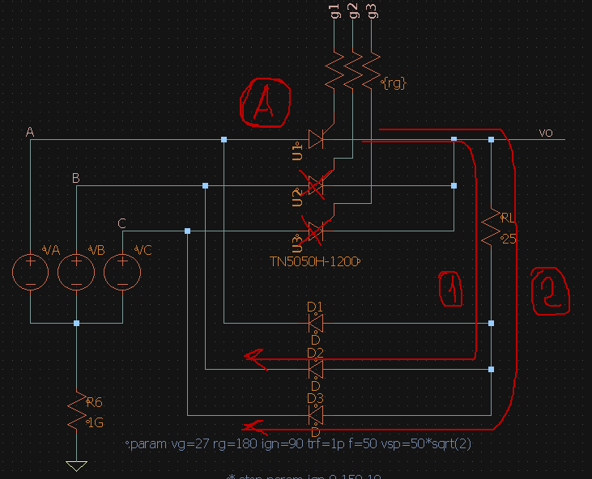
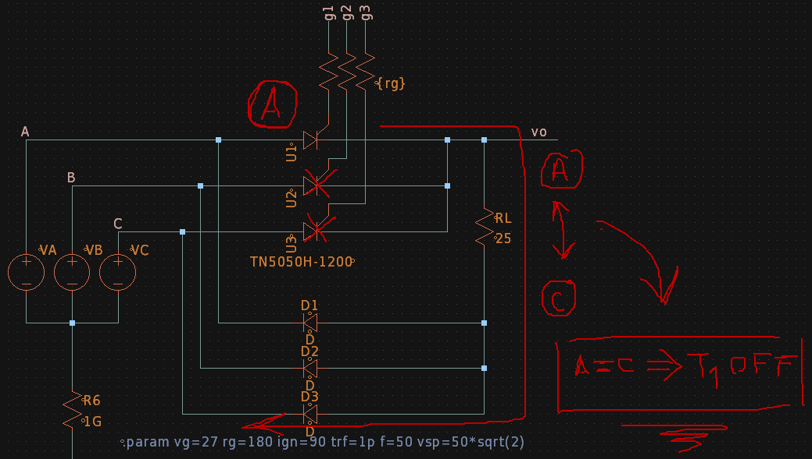
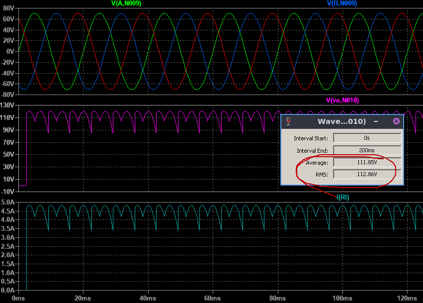
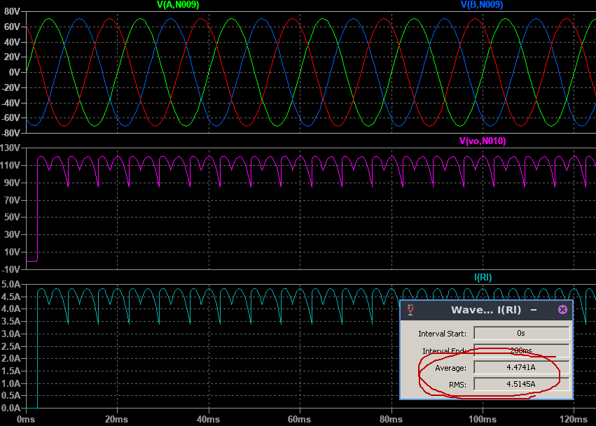
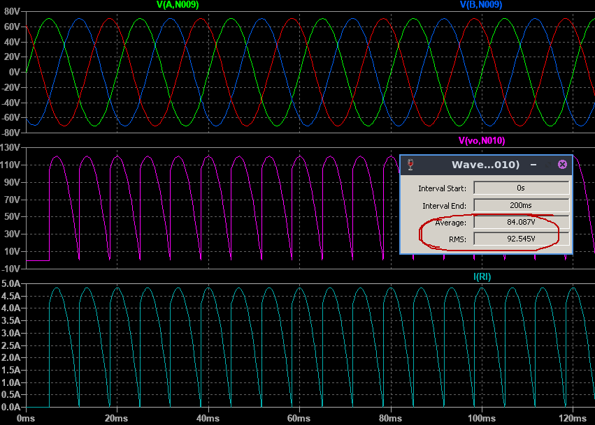
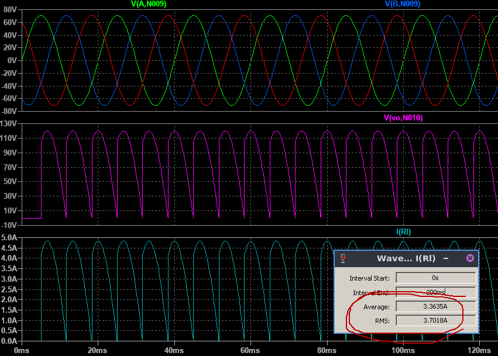
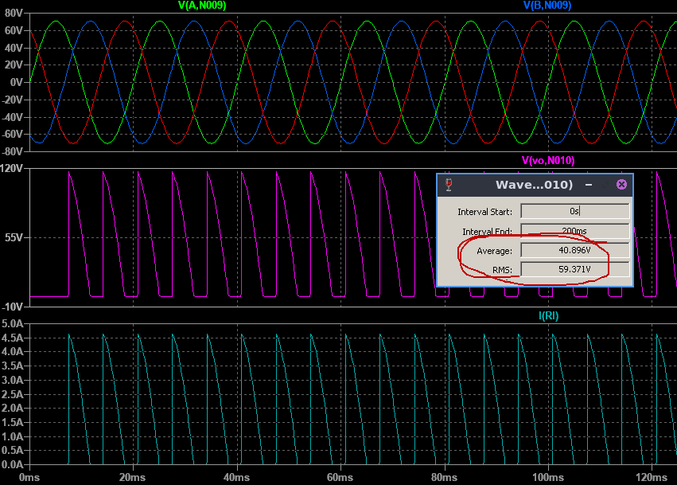
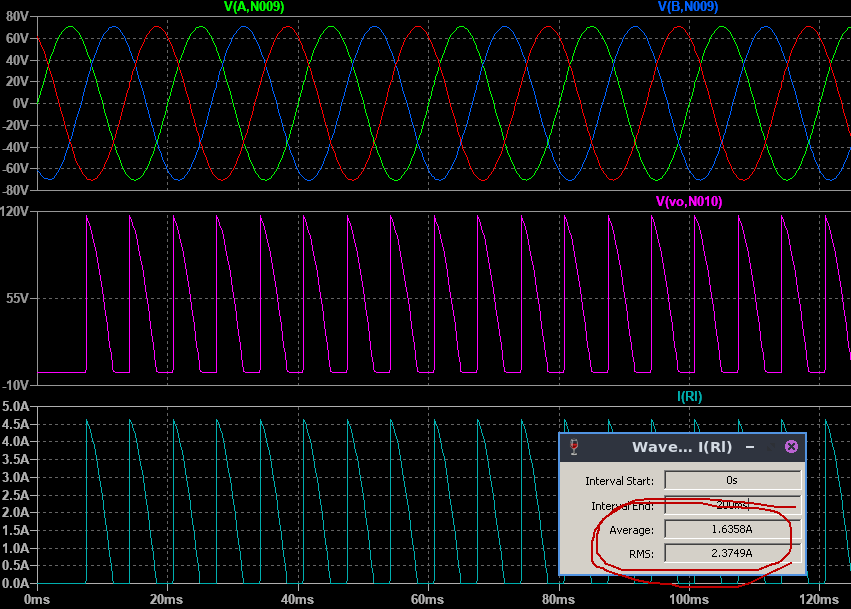

# **FCEFyN - UNC - ELECTRÓNICA INDUSTRIAL**
## DOCENTE: Prof. Esp. Ing. Adrián Claudio Agüero
## ALUMNO: Ferraris Domingo Jesus

---------------------------------------
---------------------------------------

# **Trabajo practico teorico 4:** 
## Mosfet de potencia.

-----------------------------------------

## **1. Tiristor elegido.** 

Se eligio el ***Tiristor de potencia VS-50RIA-100*** en version Stud, de Vishay Semiconductors.

### **Caracteristicas:**

En la hoja de datos tenemos las siguientes caracteristicas principales:

* **ITav:** 50A como maximo con encapsulado a 94°C y aplicando el semi-periodo de una senoidal.
* **VTrms:** 80A como maximo.
* **ITSM:** Nos da los valores para un pulso senoidal de 10ms/8.3ms de 1430 / 1490A si despues del pulso no se reaplica tension, y 1200 / 1255A si luego del pulso se reaplica la tension VRRM. 
* **VDRM/VRRM:** Para este dispositivo de la serie es de 1kV, para directa o inversa. 
* **VRSM:** No repetitiva de 1.1kV para pulsos menores o iguales a 5ms.
* **i2t:** Nos da los valores para un pulso senoidal de 10ms/8.3ms de 10.18 / 9.30kA2s si despues del pulso no se reaplica tension, y 7.20 / 6.56kA2s si luego del pulso se reaplica la tension VRRM. 

### **Parametros de compuerta:**

El fabricante nos da las caracteristicas maximas de compuerta para tension aplicada maxima VGM de +20 / -10V, corriente maxima IGM de 2.5A, potencia media PGav de 2.5W y potencia maxima pico PGM de 10W durante 5ms o menos.

Tambien nos da los valores de disparo:

El tiristor dispara con 100mA y 2.5V o mas en compuerta (IGT/VGT), mientras que no dispara con 5mA y 0.2V o menos en compuerta (IGD/VGD).

Con estos datos podemos graficar la caracteristica de compuerta aproximada (no esta a escala) e identificar la zona de disparo incierta (ZDI) y el punto pivote para la seleccion de la resistencia de disparo:

Ademas el fabricante nos da en este caso la caracteristica de compuerta para toda la serie VS50-RIA:

### **Potencia vs corriente media:**

El fabricante tambien nos da la curva de degradacion de potencia media en funcion de la corriente media para una senoidal con distintos angulos de conduccion.

Por ejemplo para una corriente media de 25A y un angulo de conduccion de 180° (medio ciclo senoidal) el tiristor puede disipar hasta 30W como maximo.

Tambien en los extremos de cada curva nos indican el limite maximo de corriente RMS. Notamos como para angulos de conduccion menores la corriente RMS decrece, esto es porque esta se hace mas impulsiva pudiendo superar la temperatura maxima de juntura.

### **Montaje en aplicacion de potencia:**

Para un puente rectificador monofasico de onda completa semi-controlado con carga resistiva, el esquema seria el siguiente:

Al ser los tiristores de tipo anodo a stub, estos se deben conectar despues de la carga. Se toma un disipador y se roscan los 2 diodos de potencia tipo catodo stub, seconectan sus catodos a la fase del transformador y como el disipador es el catodo se conecta a la carga directamente.
Luego sobre otro disipador se roscan los anodos de los tiristores, los catodos por separado se conectan a las fases del transformador, el disipador a la carga y los gates por separado a los terminales del circuito de disparo.
Siempre se debe tener cuidado de no pasar del torque maximo dado por el fabricante para cada diodo o tiristor.

CORREJIR APLICACION

--------------------------------------------------

cond 1 cierra por B, cond cierra por C, tension final VAC

no en 180, sino cuando A es igual a C el tiristor 1 se apaga

dibujar para el caso no controlado, acotar la onda segun angulo, antes de conducir corriente cero, despues corriente baja.

salvando alguna asimetria la forma de onda se respeta entonces sirve

2 cosenos centrados en cero, valor minimo cero, area del primero de -2pi/12 + ac a 2pi/12, area del segundo -2pi/12 a 2pi/12 + ac.

definir el angulo de extincion como el intervalo desde que puede conducir hasta donde corta, el de ignicion desde donde puede concudir hasta donde comienza a hacerlo

para corriente 
* periodo 2pi/3
* corriente pico de linea

para tension
* periodo 2pi/3
* tension pico de linea

para el primer impulso 
* coseno centrado en cero
* desde -2pi/12+pi/12 a 2pi/12
* corriente pico de linea

para el segundo impulso 
* coseno centrado en cero
* desde 2pi/12 a 2pi/12+pi/12
* corriente pico de linea

para 45

$$
\begin{align*}
\frac{3}{2\pi }\int _{-\frac{2\pi }{12}+\frac{\pi }{12}}^{\frac{2\pi \:}{12}}cos\left(\theta \right)d\theta +\frac{3}{2\pi \:}\int _{-\frac{2\pi \:}{12}}^{\frac{2\pi \:}{12}+\frac{\pi \:}{12}}cos\left(\theta \right)d\theta \:\:
\end{align*}
$$

$$
\begin{align*}
\frac{3}{2\pi }\left(\int _{-\frac{2\pi \:}{12}+\frac{\pi \:}{12}}^{\frac{2\pi \:}{12}}\left(cos\left(\theta \right)\right)^2d\theta \:\:+\int _{-\frac{2\pi \:\:}{12}}^{\frac{2\pi \:\:}{12}+\frac{\pi \:}{12}}\left(cos\left(\theta \right)\right)^2d\theta \right)\:\:
\end{align*}
$$

de la misma forma se calculo para los demas 

para 90

para 135

conclusiones le dicen al tuio...

-------------------------------------
-------------------------------------

<!---
Insertar latex en pdf
--->

